Greetings everyone. In this write-up, I’ll be tackling the `Bombs Landed` challenge — my first time dealing with a medium-level (50 points) reversing challenge. I’m excited to share what I’ve learned and fill in the gaps since there are no detailed write-ups available. However, I won’t be giving away the flag directly. Instead, I’ll do my best to provide a comprehensive understanding of the challenge while still keeping things engaging.

Here’s the challenge prompt - 

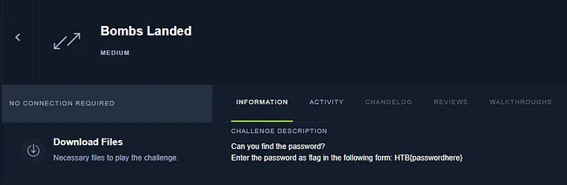 

We’re on the hunt for the hidden password in the binary. Let’s begin.

## Initial Analysis

Let’s try to run this program.

```bash
/mnt/H/Misc > ./BombsLanded                                                                    
Bad luck dude.
/mnt/H/Misc > ./BombsLanded 1                                                                  
Bad luck dude.
/mnt/H/Misc > ./BombsLanded 1 2                                                                
Bad luck dude.
/mnt/H/Misc > ./BombsLanded 1 2 3                                                              
input password: itworked 
Bad luck dude.
```

Running the binary as is only results in the message `Bad luck dude.` being displayed, with no opportunity for input. However, after some experimentation, we discover that the binary requires at least three arguments. This will become clearer in the decompilation process. When we run the binary with the correct number of arguments, it prompts for a password but, as expected, our initial attempt is met with `Bad luck dude.`

```bash
/mnt/H/Misc > file BombsLanded                                                                 
BombsLanded: ELF 32-bit LSB executable, Intel 80386, version 1 (SYSV), for GNU/Linux 2.6.32, BuildID[sha1]=53d6c985990fd9b8ed4f1caf10ce7d64e14b2121, dynamically linked, interpreter /lib/ld-linux.so.2, no section header
```

The `file` command reveals that this binary is a 32-bit, dynamically linked executable with no section headers. This makes things tricky, as the lack of clear boundaries between the `.data`, `.text`, and `.rodata` sections complicate understanding the binary's structure and functions. And, with symbols and code sections resolved during runtime, reverse engineering the binary is going to require a little extra effort.

```bash
/mnt/H/Misc > readelf -s BombsLanded                                                           

Dynamic symbol information is not available for displaying symbols.
/mnt/H/Misc > readelf --dynamic BombsLanded                                                    

Dynamic section at offset 0x1010 contains 29 entries:
  Tag        Type                         Name/Value
 0x00000001 (NEEDED)                     Shared library: [libdl.so.2]
 0x00000001 (NEEDED)                     Shared library: [libc.so.6]
 0x0000000c (INIT)                       0x8048670
 0x0000000d (FINI)                       0x8048c54
 0x00000019 (INIT_ARRAY)                 0x8049000
 0x0000001b (INIT_ARRAYSZ)               8 (bytes)
 0x0000001a (FINI_ARRAY)                 0x8049008
 0x0000001c (FINI_ARRAYSZ)               4 (bytes)
 0x6ffffef5 (GNU_HASH)                   0x804818c
 0x00000005 (STRTAB)                     0x8048318
 0x00000006 (SYMTAB)                     0x80481b8
 0x0000000a (STRSZ)                      283 (bytes)
 0x0000000b (SYMENT)                     16 (bytes)
 0x00000015 (DEBUG)                      0x0
 0x00000003 (PLTGOT)                     0x8049130
 0x00000002 (PLTRELSZ)                   104 (bytes)
 0x00000014 (PLTREL)                     REL
 0x00000017 (JMPREL)                     0x8048608
 0x00000011 (REL)                        0x80484c0
 0x00000012 (RELSZ)                      328 (bytes)
 0x00000013 (RELENT)                     8 (bytes)
 0x00000016 (TEXTREL)                    0x0
 0x0000001e (FLAGS)                      TEXTREL
 0x6ffffffb (FLAGS_1)                    Flags: PIE
 0x6ffffffe (VERNEED)                    0x8048460
 0x6fffffff (VERNEEDNUM)                 2
 0x6ffffff0 (VERSYM)                     0x8048434
 0x6ffffffa (RELCOUNT)                   18
 0x00000000 (NULL)                       0x0
```

As we can see, the only information we can retrieve is about the dynamic section of the binary. The dynamic section shows that the binary has an initialization and finalization function, as the `INIT` and `FINI` entries have absolute addresses at the very least.

```bash
/mnt/H/Misc > checksec BombsLanded                                                             
[!] Did not find any GOT entries
[*] '/mnt/HackingUnixBinariesStuff/Misc/BombsLanded'
    Arch:     i386-32-little
    RELRO:    No RELRO
    Stack:    No canary found
    NX:       NX disabled
    PIE:      No PIE (0x8048000)
    RWX:      Has RWX segments
```

Another helpful aspect is that the binary doesn’t have Position Independent Executable (PIE) enabled. This is evident from the use of absolute addresses in the dynamic section of the binary. This makes our reverse engineering journey a bit smoother, as we don’t have to worry about dealing with address relocations when setting breakpoints.

```bash
/mnt/H/Misc > strings BombsLanded                                                       1m 49s 
/lib/ld-linux.so.2
libdl.so.2
_ITM_deregisterTMCloneTable
__gmon_start__
_Jv_RegisterClasses
_ITM_registerTMCloneTable
dlsym
libc.so.6
_IO_stdin_used
exit
strncmp
__isoc99_scanf
puts
printf
mmap
strlen
memset
getchar
malloc
ptrace
__cxa_finalize
__libc_start_main
free
GLIBC_2.0
GLIBC_2.7
GLIBC_2.1.3
fPf1
fPfP
WVSQ
Y[^_]
UWVS
t$,U
[^_]
input password: 
Correct password:
Bad luck dude.
strncmp
;*2$"
cccc
g r c
cccc
g j c
```

When we run the strings command on the binary, we see some interesting strings such as `mmap`, `malloc`, `strncmp`, and `dlsym`. These strings indicate that the symbols and other sections requiring resolving are resolved dynamically, as the presence of `dlsym` explicitly confirms.

We also see the strings `input password:`, `Correct password:`, and `Bad luck dude.`, which are important for our understanding of the binary. Note that the colon against `Correct password` is peculiar, and we will explore this soon. Additionally, the presence of `scanf` when `getchar` is already present seems odd for a simple program that just uses stdin once.

On the other hand, there is a problem that a lot of solvers apparently encounter.

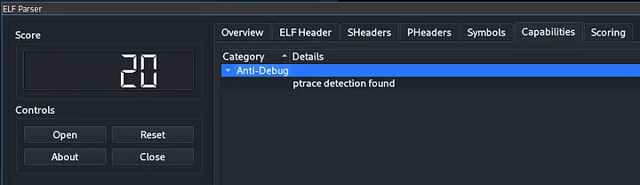 

According to `elfparser`, the binary has `ptrace` detection enabled.

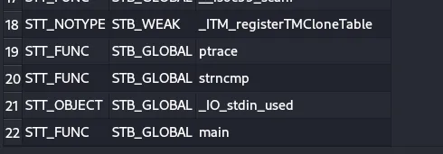 

Here, we can see that the function `main` is both defined and a global function. In my solution, I did not face any issues with this, but for those who might, here's a way to bypass it:

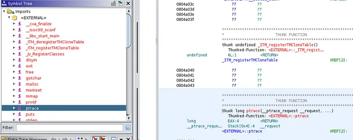 

Here, we can see that the function `ptrace` is defined as an external import in Ghidra (you can use tools like IDA Pro, radare2 and Binary Ninja if you want).

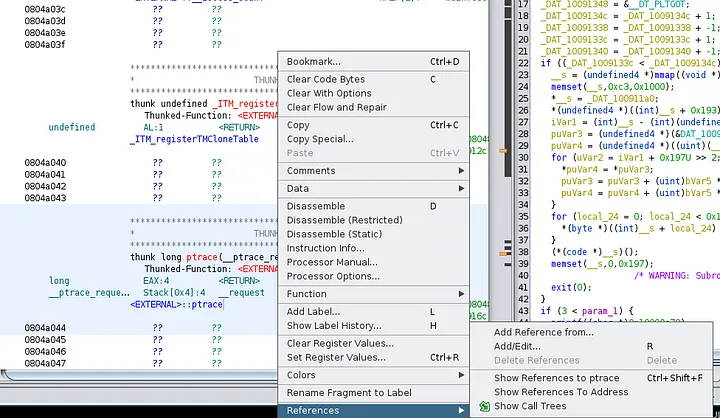 

On the function itself, right-click and select `Show references to ptrace` in the References tab.

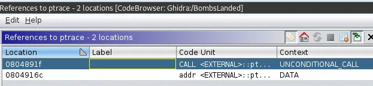 

You will see that, there is an unconditional call to `ptrace` in this case. Double-click and take a look at the disassembly.

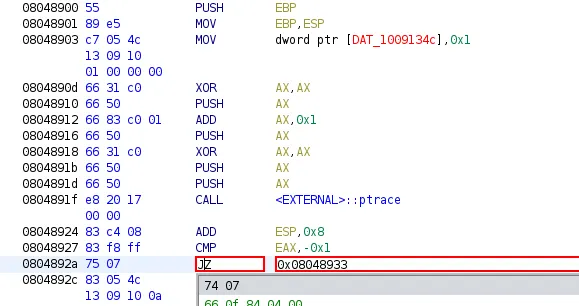 

Here, originally this instruction was `JNZ`, and now we attempt to reassemble it as a `JZ` instruction instead. If you are debugging, the value of `EAX` after the ptrace call will most certainly be `0xffffffff` or -1. Thus, the `CMP` instruction will be passed as a check and you will pass the overall `ptrace` check.

There are many other ways to bypass this `ptrace` check. You could try removing the call to `ptrace` altogether by replacing it with `NOPs` either in the `ptrace` function itself or the `call` function. You can even set the value of `EAX` accordingly to pass the check while debugging. But it’s easier to just patch the binary instead of doing that every debug session.

## Decompilation And Disassembly

We open up the binary in Ghidra to take a look at the disassembly and its decompilation side by side.

```c
undefined4 main(int param_1)

{
  int iVar1;
  undefined4 *__s;
  uint uVar2;
  undefined4 *puVar3;
  undefined4 *puVar4;
  byte bVar5;
  uint local_24;
  
  bVar5 = 0;
  _DAT_10091348 = &__DT_PLTGOT;
  _DAT_1009134c = _DAT_1009134c + 1;
  _DAT_10091338 = _DAT_10091338 + -1;
  _DAT_1009133c = _DAT_1009133c + 1;
  _DAT_10091340 = _DAT_10091340 + -1;
  if ((_DAT_1009133c < _DAT_1009134c) && (param_1 < 5)) {
    __s = (undefined4 *)mmap((void *)0x0,0x1000,7,0x22,-1,0);
    memset(__s,0xc3,0x1000);
    *__s = _DAT_100911a0;
    *(undefined4 *)((int)__s + 0x193) = _DAT_10091333;
    iVar1 = (int)__s - (int)(undefined4 *)((uint)(__s + 1) & 0xfffffffc);
    puVar3 = (undefined4 *)(&DAT_100911a0 + -iVar1);
    puVar4 = (undefined4 *)((uint)(__s + 1) & 0xfffffffc);
    for (uVar2 = iVar1 + 0x197U >> 2; uVar2 != 0; uVar2 = uVar2 - 1) {
      *puVar4 = *puVar3;
      puVar3 = puVar3 + (uint)bVar5 * -2 + 1;
      puVar4 = puVar4 + (uint)bVar5 * -2 + 1;
    }
    for (local_24 = 0; local_24 < 0x197; local_24 = local_24 + 1) {
      *(byte *)((int)__s + local_24) = *(byte *)((int)__s + local_24) ^ 99;
    }
    (*(code *)__s)();
    memset(__s,0,0x197);
                    /* WARNING: Subroutine does not return */
    exit(0);
  }
  if (3 < param_1) {
    printf((char *)0x10090c70); //input password:
    iVar1 = getchar();
    if ((char)iVar1 == 'X') {
      (*(code *)0xc3)();
      __isoc99_scanf(0x10090c81); //Correct password:
    }
  }
  puts((char *)0x10090c93); //Bad luck dude.
  return 0;
}
```

This is the main function as decompiled by Ghidra. Here is where the weirdness happens. As you can see, it’s not an ordinary password checker. It has something else going on altogether before it. Even the password checking part is odd. Furthermore, none of the variables above are used in the password checker and is completely separate.

First, it prints out `input password: ` and takes input via getchar. It checks whether the first character of the input we give is `X` or not. If it is, a function with the address `c3` is called and `Correct password: ` is passed as an argument to `scanf`. This makes no sense and there is no way to retrieve the password here. I spent at least 4–5 hours tinkering with this section of `main` and got nowhere. It is the most interesting rabbit hole I have seen in my short reverse-engineering journey.

What to do then?

Well, we can try to focus on the code above then since there is no other function with code that may be relevant. To do that, we must first pass the if condition `if ((_DAT_1009133c < _DAT_1009134c) && (param_1 < 5))`. In my experience, it has always been safer to just switch up the conditional jumps to their opposite counterparts. Which is exactly what we will do. Alternatively, we can try to change the values of the registers in `gdb-pwndbg` or patch the binary to always fulfill the condition. Or we can remove the condition altogether.

```c
080489b8 39 c1           CMP        ECX,EAX
080489ba 77 05           JA         LAB_080489c1
080489bc 83 3a 04        CMP        dword ptr [EDX]=>param_1,0x4
080489bf 7f 57           JG         LAB_08048a18
```

This part of the assembly code concerns with the check that needs to be passed. To do this, we will switch from `JA` to `JBE` and from `JG` to `JLE`. This should work because the values in the registers before the `CMP` instruction always seem to be the same, so patching the code would allow it to pass the checks.

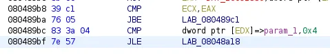 

This is the patched code. Now, let’s jump to the CMP directly by breaking at 0x80489b8.

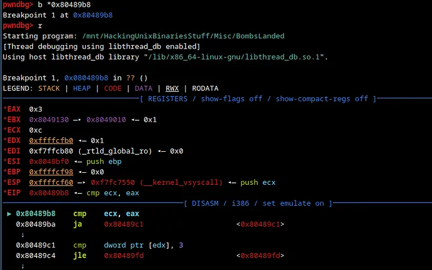 

We break at the `CMP` instruction successfully.

 

Stepping through the code, we successfully bypass the check as seen above. After bypassing the check, we step through the code until we see this loop -

```c
   0x8048a9a    movzx  edx, byte ptr [edx]
   0x8048a9d    xor    edx, 0x63
   0x8048aa0    mov    byte ptr [eax], dl
   0x8048aa2    add    dword ptr [ebp - 0x1c], 1
   0x8048aa6    mov    eax, dword ptr [ebp - 0x1c]
 ► 0x8048aa9    cmp    eax, 0x196
   0x8048aae    jbe    0x8048a8a                     <0x8048a8a>
```

At the `jbe` instruction, we will loop a couple of times. So, to end the loop, we will use `x/3i $eip` to set a breakpoint on the address after `jbe.

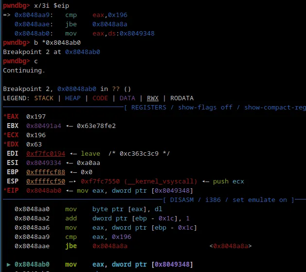 

As you can see that worked perfectly.

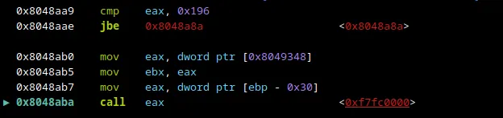 

And then, three instructions after `JBE`, we'll see a `CALL EAX`. This is where the flag is hidden. To step into this, we'll use the `si` (step into) command.

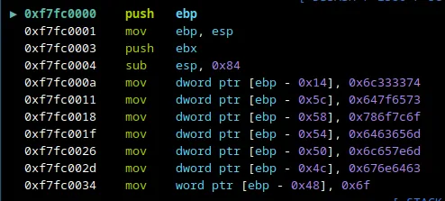 

As you can see, there are multiple `MOV` instructions done with a couple of hex characters. There is a high likelihood of this having something to do with our flag.

```c
   0xf7fc000a    mov    dword ptr [ebp - 0x14], 0x6c333374
   0xf7fc0011    mov    dword ptr [ebp - 0x5c], 0x647f6573
   0xf7fc0018    mov    dword ptr [ebp - 0x58], 0x786f7c6f
   0xf7fc001f    mov    dword ptr [ebp - 0x54], 0x6463656d
   0xf7fc0026    mov    dword ptr [ebp - 0x50], 0x6c657e6d
   0xf7fc002d    mov    dword ptr [ebp - 0x4c], 0x676e6463
   0xf7fc003a    mov    dword ptr [ebp - 0x6d], 0x61647a7d
   0xf7fc0041    mov    dword ptr [ebp - 0x69], 0x75643460
   0xf7fc0048    mov    dword ptr [ebp - 0x65], 0x7b636767
   0xf7fc004f    mov    dword ptr [ebp - 0x61], 0x342e7066
```

These are all the instructions featuring a series of hex strings.

```python
>>> import pwn
>>> l=[0x6c333374,0x647f6573,0x786f7c6f,0x6463656d,0x6c657e6d,0x676e6463,0x61647a7d,0x75643460,0x7b636767,0x342e7066]
>>> print(''.join([pwn.p32(i).decode() for i in l]))
t33lsedo|oxmecdm~elcdng}zda`4duggc{fp.4
>>>
```

Using `pwntools`, we try to decrypt these hex characters into strings and we get a row of nonsense.

As it turns out, this string (in little-endian) is looped through and eventually produces the string `input password: `

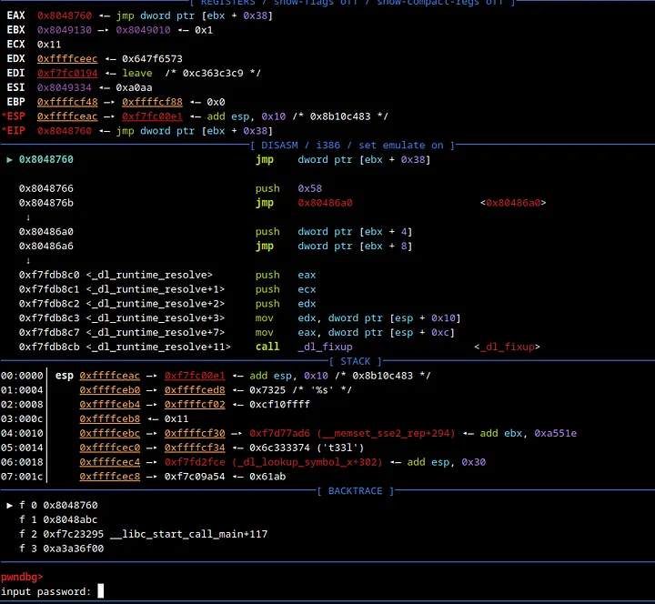 

We can see that happening above here.

```c
00:0000│ esp 0xffffceb0 —▸ 0xffffcedb ◂— 'input passw{fp.4'
01:0004│     0xffffceb4 ◂— 0x3055e4
02:0008│     0xffffceb8 —▸ 0xf7fc1958 —▸ 0xf7ffdbac —▸ 0xf7fc1a94 —▸ 0xf7ffda40 ◂— ...
03:000c│     0xffffcebc —▸ 0xffffcf30 —▸ 0xf7d77ad6 (__memset_sse2_rep+294) ◂— add ebx, 0xa551e
04:0010│     0xffffcec0 —▸ 0xffffcf34 ◂— 0x6c333374 ('t33l')
05:0014│     0xffffcec4 —▸ 0xf7fd2fce (_dl_lookup_symbol_x+302) ◂— add esp, 0x30
06:0018│     0xffffcec8 —▸ 0xf7c09a54 ◂— 0x61ab
07:001c│     0xffffcecc —▸ 0xffffcf34 ◂— 0x6c333374 ('t33l')
```

In the stack above, we also see remnants of the string we converted using python. Thus, it’s possible that when the instruction `strncmp` is run against our input, a similar decryption loop occurs and thus we will be able to see the flag.

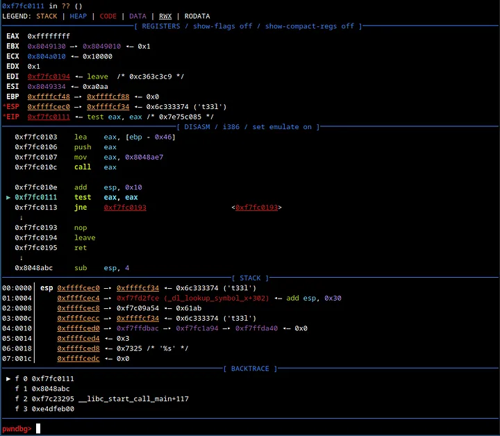 

When you reach this part of the execution, if `EAX` is not equal to `0x0`, the program eventually exits. However, when debugging, we can set `EAX` to `0x0` by using the command `set $eax=0x0`. Once this is done, you will be greeted with the result.

We are on the right track, but we are skipping a certain part of the code.

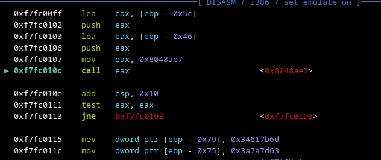 

This is the only instruction that looked suspicious enough before the checking (and printing `you win` if you get it right). On stepping in a few instructions inside the `CALL EAX`, we see the following -

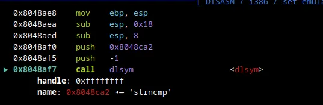 

Now, we know we are on the right track since we see that `strncmp` is now resolved using `dlsym`. Normally, in `gdb-pwndbg` you can see the arguments fed into `strncmp` but here we can't since this is just a dynamically linked symbol within the `CALL EAX`. This tells me that the `CALL EAX` done is actually running `strncmp`. Thus, let's step over the call `dlsym` and see what happens.

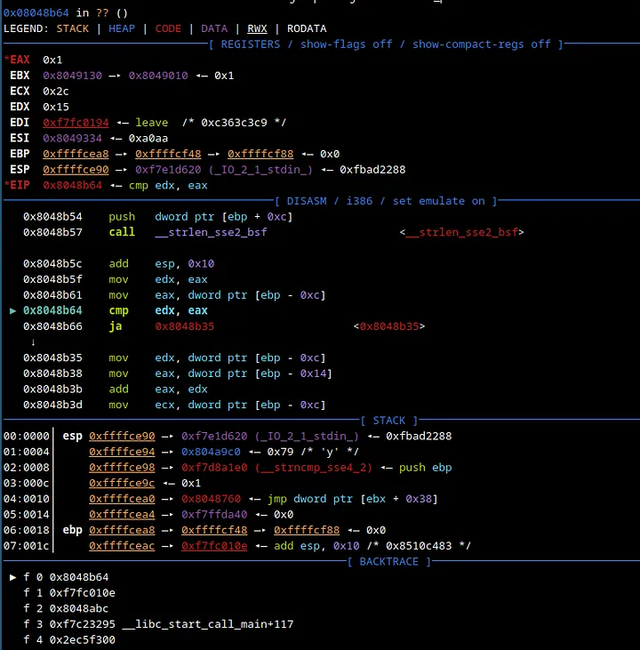 

After stepping in with `ni` a couple of times, we start to see interesting things. Take a look at `$esp+4`. We see a `y`. Let's step in some more.

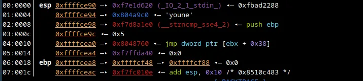 

We are starting to see something interesting. After stepping enough times we find the password.

```c
00:0000│ esp 0xffffce80 —▸ 0xffffcf02 ◂— 'asdasdadsasda'
01:0004│     0xffffce84 —▸ 0x804a9c0 ◂— 'younexxxxxxxx'
02:0008│     0xffffce88 ◂— 0x15
03:000c│     0xffffce8c —▸ 0xf7c53b25 (__isoc99_scanf+37) ◂— add esp, 0x1c
04:0010│     0xffffce90 —▸ 0xf7e1d620 (_IO_2_1_stdin_) ◂— 0xfbad2288
05:0014│     0xffffce94 —▸ 0x804a9c0 ◂— 'younexxxxxxxx'
06:0018│     0xffffce98 —▸ 0xf7d8a1e0 (__strncmp_sse4_2) ◂— push ebp
07:001c│     0xffffce9c ◂— 0x15
```

Here, I’ve censored the password, but you can see it in the stack if you try this method out for yourself.

The final flag is `HTB{<the password you find on the stack>}`.

I still couldn’t figure out where this piece of code came from. I tried searching for cross-references of functions like `dlsym`, `strncmp`, and `strlen`, but all I found was a reference to an unknown code unit. This means that the code we just looked at was created at runtime and can't be found in static analysis. Extremely interesting puzzle and I learned a lot about anti-reversing/debugging and how difficult it can be to bypass such measures.

I hope you learned something from this blog :)

Thank you for reading.


