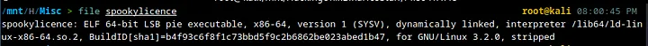
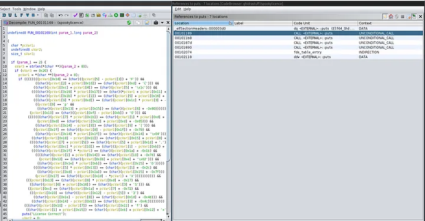
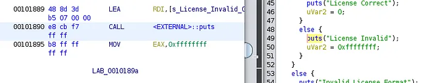
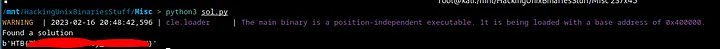

Greetings everyone. In this write-up, I’ll be tackling the “Spooky License” challenge — an easy-level (20 points) reversing challenge. I am covering this challenge to give some exposure to the capabilities of `angr`, a tool which can do concolic analysis of binaries (don't worry relevant links will be put under).

I have always had trouble deobfuscating custom string manipulations/encryptions/checks and wanted to do away with the work of manually reversing them. I saw a YouTube video made by a friend on Discord on `angr` (embedded below) and was immediately attracted to its capabilities.

<iframe width="994" height="559" src="https://www.youtube.com/embed/QkVzjn3z0iw" title="Reversing with Angr | State Manipulation and Symbolic Execution" frameborder="0" allow="accelerometer; autoplay; clipboard-write; encrypted-media; gyroscope; picture-in-picture; web-share" allowfullscreen></iframe>

It seemed that a lot of the CTF community also uses `angr` for the same annoyances I often dealt with in challenges. With that said, let’s begin with the challenge.


There’s no description given, but from the title of the challenge, we can infer some kind of license check. We are given a single Linux binary on extracting the contents of the provided zip file. Let’s take a look at it.

&nbsp;

## Analysis



On running `file` on the binary, we see that it is a `64-bit stripped` binary (which makes things a little harder if we were to normally reverse engineer this). It is also `PIE-enabled` which is something we need to keep in mind.


When we run it without any input, it tells us to provide an argument. On giving it an argument, it outputs `Invalid License Format` which means we are doing something wrong with the input. Things will be clearer when we open this up in `Ghidra`, so let’s do that.


On loading and analyzing the binary in `Ghidra`, we see the above functions. I took a bet and thought that when the program printed out `Invalid license format`, this meant that puts was being called. So, the first thing to do here would be to check for references to `puts`.



On checking the first unconditional call to `puts`, we are able to get to the license-checking function (we can see the string `License Correct`). Now, we can take a look at what’s actually happening.

```c
undefined8 FUN_00101169(int param_1,long param_2)

{
  char *pcVar1;
  undefined8 uVar2;
  size_t sVar3;

  if (param_1 == 2) {
    sVar3 = strlen(*(char **)(param_2 + 8));
    if (sVar3 == 0x20) {
      pcVar1 = *(char **)(param_2 + 8);
      if ((((((((pcVar1[0x1d] == (char)((pcVar1[5] - pcVar1[3]) + 'F')) &&
               ((char)(pcVar1[2] + pcVar1[0x16]) == (char)(pcVar1[0xd] + '{'))) &&
              ((char)(pcVar1[0xc] + pcVar1[4]) == (char)(pcVar1[5] + '\x1c'))) &&
             ((((char)(pcVar1[0x19] * pcVar1[0x17]) == (char)(*pcVar1 + pcVar1[0x11] + '\x17') &&
               ((char)(pcVar1[0x1b] * pcVar1[1]) == (char)(pcVar1[5] + pcVar1[0x16] + -0x15))) &&
              (((char)(pcVar1[9] * pcVar1[0xd]) == (char)(pcVar1[0x1c] * pcVar1[3] + -9) &&
               ((pcVar1[9] == 'p' &&
                ((char)(pcVar1[0x13] + pcVar1[0x15]) == (char)(pcVar1[6] + -0x80))))))))) &&
            (pcVar1[0x10] == (char)((pcVar1[0xf] - pcVar1[0xb]) + '0'))) &&
           (((((((char)(pcVar1[7] * pcVar1[0x1b]) == (char)(pcVar1[1] * pcVar1[0xd] + '-') &&
                (pcVar1[0xd] == (char)(pcVar1[0x12] + pcVar1[0xd] + -0x65))) &&
               ((char)(pcVar1[0x14] - pcVar1[8]) == (char)(pcVar1[9] + '|'))) &&
              ((pcVar1[0x1f] == (char)((pcVar1[8] - pcVar1[0x1f]) + -0x79) &&
               ((char)(pcVar1[0x14] * pcVar1[0x1f]) == (char)(pcVar1[0x14] + '\x04'))))) &&
             ((char)(pcVar1[0x18] - pcVar1[0x11]) == (char)(pcVar1[0x15] + pcVar1[8] + -0x17))) &&
            ((((char)(pcVar1[7] + pcVar1[5]) == (char)(pcVar1[5] + pcVar1[0x1d] + ',') &&
              ((char)(pcVar1[0xc] * pcVar1[10]) == (char)((pcVar1[1] - pcVar1[0xb]) + -0x24))) &&
             ((((char)(pcVar1[0x1f] * *pcVar1) == (char)(pcVar1[0x1a] + -0x1b) &&
               ((((char)(pcVar1[1] + pcVar1[0x14]) == (char)(pcVar1[10] + -0x7d) &&
                 (pcVar1[0x12] == (char)(pcVar1[0x1b] + pcVar1[0xe] + '\x02'))) &&
                ((char)(pcVar1[0x1e] * pcVar1[0xb]) == (char)(pcVar1[0x15] + 'D'))))) &&
              ((((char)(pcVar1[5] * pcVar1[0x13]) == (char)(pcVar1[1] + -0x2c) &&
                ((char)(pcVar1[0xd] - pcVar1[0x1a]) == (char)(pcVar1[0x15] + -0x7f))) &&
               (pcVar1[0x17] == (char)((pcVar1[0x1d] - *pcVar1) + 'X'))))))))))) &&
          (((pcVar1[0x13] == (char)(pcVar1[8] * pcVar1[0xd] + -0x17) &&
            ((char)(pcVar1[6] + pcVar1[0x16]) == (char)(pcVar1[3] + 'S'))) &&
           ((pcVar1[0xc] == (char)(pcVar1[0x1a] + pcVar1[7] + -0x72) &&
            (((pcVar1[0x10] == (char)((pcVar1[0x12] - pcVar1[5]) + '3') &&
              ((char)(pcVar1[0x1e] - pcVar1[8]) == (char)(pcVar1[0x1d] + -0x4d))) &&
             ((char)(pcVar1[0x14] - pcVar1[0xb]) == (char)(pcVar1[3] + -0x4c))))))))) &&
         (((char)(pcVar1[0x10] - pcVar1[7]) == (char)(pcVar1[0x11] + 'f') &&
          ((char)(pcVar1[1] + pcVar1[0x15]) == (char)(pcVar1[0xb] + pcVar1[0x12] + '+'))))) {
        puts("License Correct");
        uVar2 = 0;
      }
      else {
        puts("License Invalid");
        uVar2 = 0xffffffff;
      }
    }
    else {
      puts("Invalid License Format");
      uVar2 = 0xffffffff;
    }
  }
  else {
    puts("./spookylicence <license>");
    uVar2 = 0xffffffff;
  }
  return uVar2;
}
```

This immensely convoluted if condition just breaks my head, but we can infer a few things otherwise. Firstly, our input’s (as an argument) length is checked using `strlen` and is compared with 0x20 (or 32). Secondly, I have to use that if condition to find the flag.

One way of doing this would be to debug every step of comparison with specific inputs in `gdb-pwndbg` or `EDB` and brute-force our way into a flag. This is extremely time-consuming and a great way to bore oneself. There is a much better way to do this and that’s `angr`. There are a lot of great beginner tutorials on `angr` so I will skip to my approach directly. One series of blogs on angr that I particularly like to refer to is [this](https://blog.notso.pro/2019-03-20-angr-introduction-part0/?source=post_page-----d0cd20459f29--------------------------------).

If you don’t know what `angr` does, check out the above link and all the subsequent sequels.

I shall be explaining my solution line-by-line so that it makes sense.

&nbsp;

## Approach

```python
import angr
import claripy
```

We import the necessary libraries. `angr` is for concolic execution (hybrid model of symbolic and concrete execution), and `claripy` is for instantiating a variable to be injected as a symbol.

```python
path_to_binary = "<path to binary>"
proj = angr.Project(path_to_binary, load_options={'auto_load_libs':False})
```

We define the path to our binary using the `path_to_binary variable`. We create a new angr project using `angr.Project` using the path to our binary. We also disable the auto-loading of libraries to prevent any possible code-path explosions using `load_options={‘auto_load_libs’:False}`

```python
argv = [proj.filename]
sym_arg_size = 32
sym_arg=claripy.BVS('sym_arg', 8*sym_arg_size)
argv.append(sym_arg)
```

Since we are working with arguments, we define a list of arguments that starts with the filename of the binary itself and then we append a bitvector symbol (BVS) of size `8*32 bits` (32 because the length of 0x20 is checked as seen before).

```python
entry_state = proj.factory.entry_state(args=argv,add_options={angr.sim_options.ZERO_FILL_UNCONSTRAINED_REGISTERS,angr.sim_options.ZERO_FILL_UNCONSTRAINED_MEMORY})
sim = proj.factory.simulation_manager(entry_state)
```

Here we define `entry_state` for the `angr` project with the arguments we made earlier. We also add options to zero-fill any unconstrained registers or memory `angr` finds. We do this in order to handle unknown regions without unwanted behaviour.

```python
exit_point = 0x400000+0x187d
avoid_point = 0x400000+0x1890
```

In `angr`, you can specify what addresses you want to find/avoid/start/end to incorporate in the process of concolic execution. We add `0x400000` because `angr` by default sets the base address to `0x400000` in the case of PIE-enabled binaries. Here the `exit_point` variable is just the ending address of the function that does the license checking.



Meanwhile, the `avoid_point` is the address at which the `puts` function on `License Invalid` is called.

```python
sim.explore(find=exit_point, avoid=avoid_point)
if sim.found:
    print("gottem")
    solution = sim.found[0].solver.eval(argv[1], cast_to=bytes)
    print(solution)
else:
    print("failed")
```

Finally on the defined `entry_state` in `sim`, we run the `explore` function to start brute-forcing the BVS that leads us to a specific code path that prints out `License Correct`.



As we can see, we are able to get the flag using the script we just made.

I hope this write-up was a learning experience. Be sure to check out the links I put up to learn more about what `angr` can do. I did not mention all the details on how `angr` does stuff because the links include that.

Thank you for reading :))))
