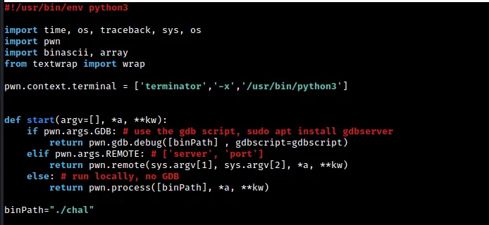
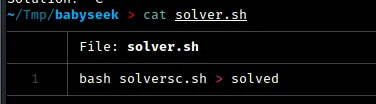
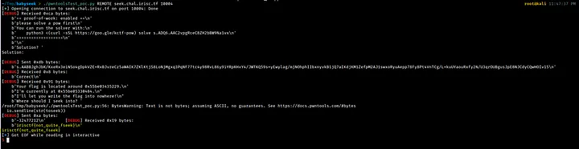

# IrisCTF 2023 - babyseek Write-up

## Preliminary Analysis

Greetings everyone. I recently had the opportunity to participate in IrisCTF 2023 and was able to complete a total of 7 challenges. One of these challenges was called “babyseek,” and the prompt for it read as follows:
 

According to the prompt for the “babyseek” challenge, we are able to “seek around” a specific file. However, when we try to access this file, it allegedly leads to nowhere since we are at /dev/null. To complete the challenge, we were provided with both a remote endpoint and a zip file to work with. Upon unzipping the zip file, we discovered the following:

The “babyseek” challenge provided us with a binary file called “chal” as well as its accompanying source code. A Dockerfile was also included, which allowed us to test any exploits we developed. While working on this challenge, I found that I didn’t actually need to use the Dockerfile. However, it did come in handy later on when I was working on the “ret2libm” challenge, which I plan to write about in a separate post.

Now, let’s take a closer look at the source code itself.

According to the source code, this program first prints out the memory address of the `win` function. It then prompts the user for an integer input, which is used as a positional offset from the start of the `/dev/null` file. The program also prints out the current position of the null character. After that, it uses the `fwrite` function to write the value of the `super_special` pointer (which points to the address of the `win` function) to the `/dev/null` stream at the specified position.

We run the binary and the output is as expected.

On running checksec on the binary, we see that NX and PIE is enabled. There’s no RELRO either, so that means we can overwrite GOT entries very easily.

## My Approach

To exploit this, I decided to input an offset that would overwrite the call to the exit function in the main function with the address of the `win` function. This would cause the program to execute the win function and print the contents of the `/flag` file when it finishes running, instead of exiting as intended.

To do this, we were given the addresses of both the `win` and `null` functions at their respective starting file offsets. Our goal was to use these addresses to somehow reach the address of the `exit` function.

To assist with this process, I used the `pwntools` library to attach `gdb-pwndbg` to a process running the `chal` binary. I will explain in more detail how I did this after I describe the steps I took to locate the address of the `exit` function.

As demonstrated in the attached screenshot, by using the flag `GDB`, it is possible to launch a debugging session with `pwndbg` that breaks at the `scanf` function (I will provide instructions on how to do this later).

For now, let’s turn our attention to the new terminal window that has been opened with `GDB`.

If you take a close look at the value stored in the `RDX` register (I stepped 3 instructions after the `scanf` function), you will notice that it represents our current position in the file stream of the `null` function. It's important to keep this in mind as we continue.

By running the `got` command in `pwndbg`, it is possible to view all of the `libc` functions along with their corresponding addresses. The addresses that are colored white are of particular interest to us, as they are located in the `got.plt` section of the binary.

One way I attempted to reach the address of the exit function was to simply subtract its address from the value stored in the `RDX` register (which holds the address of the current file pointer). This would give me the offset to subtract from the current file pointer in order to reach the desired address. In other words:

`curr + (curr-exit())`

I initially tried hardcoding this offset, but it turns out that it changes with every run of the program.

As you can see, the distance between the current file pointer and the win function also changes with every runtime of the program.

However, this occurrence gave me an idea. If we subtract the address of the current file pointer from the address of the `win` function, we can calculate an offset that leads us from the `null` function to the `win` function.

As demonstrated above, by calculating the offset that leads us to the `win` function, we are able to reach it consistently in both runs of the program. And when we subtract the address of the `win` function from the address of the `exit` function in the `GOT` section, the resulting offset remains unchanged (8767 in this case).

Based on this information, we can construct a formula that will always allow us to reach the `exit` function. It is as follows:

`exit = curr + [(win-curr)+8767] (or 0x223f)`

The input we provide to the program will simply be `[(win-curr)+8767] (or 0x223f)`, and this will allow us to overwrite the address of the `exit` function with the address of the `win` function.

With that said, let’s move on to constructing our `pwntools` script. I will also explain how I dealt with the Proof of Work (PoW) solver within the same script.

&nbsp;

## Step-by-Step Construction

_This script is able to run the “chal” binary locally, with GDB enabled, and it is also able to execute the exploit remotely. However, the PoW solver isn't required when running the program locally, so I had to create a separate Python file that excludes that code in order to test the exploit more efficiently._

In this section of the script, we import several basic libraries. The most important of these is `pwn`. If you are using a different terminal emulator (such as `alacrity` or `terminator`), you may also need to include the `pwn.context.terminal` line to ensure compatibility. Since `terminator` runs using Python 3, I had to hardcode this value. For more information, you can refer to the pwn library documentation.

We also define the `start` function, which is capable of taking various arguments such as `GDB` and `REMOTE`. When called without any arguments, the `start` function launches a local process. In this function, the `gdbscript` variable needs to be formatted in a specific way, as we will see below.

As you can see in the code snippet above, the `gdbscript` variable should be defined in this specific format in order to use the desired script. In this case, the `init-pwndbg` command enables the use of the `pwndbg` debugger instead of the default `gdb` debugger. This command was made possible through an installation of the necessary tools from [this GitHub repository](https://github.com/apogiatzis/gdb-peda-pwndbg-gef).

In this section of the script, we set the log level to debug, which is the highest possible level. This provides us with a significant amount of output on the terminal that can be helpful in identifying and troubleshooting issues with I/O. If you prefer to turn off this level of logging, you can use the "critical" log level instead.

The next line sets the current context’s binary to the `chal` file using the `pwn.ELF` function and saves the resulting ELF object into the `elf` variable. This can be useful in a variety of situations. For example, if the binary had `PIE` disabled, we could use the convenient functions provided by `pwntools` to directly retrieve the addresses of functions and linked libraries. However, in this case, the binary has `PIE` enabled, so this approach is not possible.

This code snippet automates the PoW solving here. We receive 3 lines of input using `io.recvline()`.

We get a solver prompt in the next line that we need to execute. See below -

We make a script called `solver.sh` that runs `solversc.sh`.

The `solver.sh` script saves the output of `solversc.sh` into the solved file. In the pwntools script, we open this file and use the `io.sendline()` function to send the solution to the "Solution?" prompt.

After sending the solution, we receive output indicating whether the input is correct or not. To handle this output, we use another `io.recvline()` function. Once this step is complete, the actual program begins.

If you recall, when we ran the `chal` binary locally, the first two lines of output contained the addresses of the win function and the current file pointer.

To retrieve this information in the `pwntools` script, we use the `io.recvline()` function to receive the output from the program. We then decode the binary output using the `decode()` function and split the resulting string into separate pieces using the `split()` function. To obtain the exact address we need, we select the last element of the split string using the index [-1].

We repeat these steps to obtain both the address of the `win` function and the address of the current file pointer.

Once we have these values, we use the formula we constructed earlier to calculate the address we need to seek to in order to overwrite the `exit` function with the `win` function. We then use `io.recvline()` to receive the flag (since the `win()` function runs `cat /flag`).

Finally, we use the `io.interactive()` function to establish an interactive session with remote input/output (this function is particularly useful if we had run the `/bin/sh` command).

To use this script, we save it as a Python file and run it to obtain the flag, as shown in the example below.

That’s all for this writeup. I might release another writeup for the ret2libm challenge as well and others that I completed.

Thank you for reading :)))
