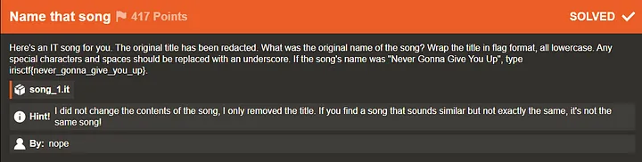
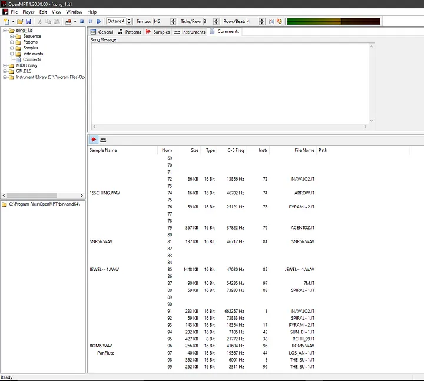
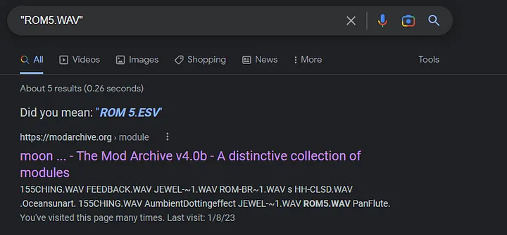
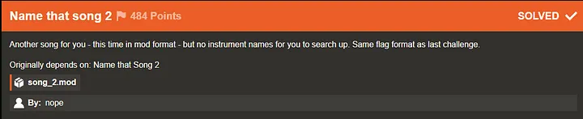
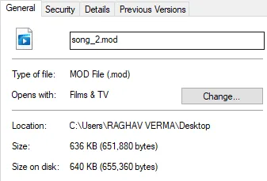
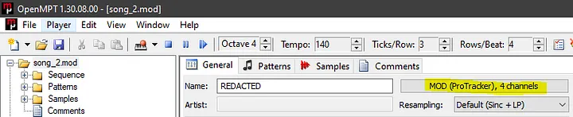
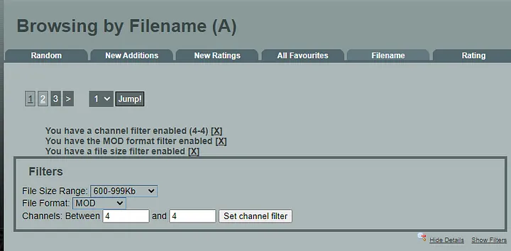

# IrisCTF 2023 — Name that song && Name that song 2 Write-up

Greetings everyone. Welcome to another write-up in our series covering the challenges from the Iris CTF 2023 event. Today, we’ll be discussing two interesting OSINT-like challenges from the Miscellaneous category: `Name that Song` and `Name that Song 2.` The challenge prompt for the first challenge reads:

## Name that song

So, we’re given a file called `song_1.it`. It's an `Impulse Tracker` file that can be played on various software, like `Schism Tracker`, `OpenMPT`, and `Impulse Tracker` itself. We'll be using `OpenMPT` to analyze this file, as compared to the other software we tried, there's more information to work with.

Let’s open it up in `OpenMPT`.

So, when we open the file in `OpenMPT`, we see a bunch of folders on the left margin. From what I understand, these files are patterns of instruments used as samples compiled into one single file. It’s a sort of MIDI-like format, but instead of a bland piano tune, you have 8-bit/16-bit instruments to supplement the resulting sound.

With that said, let’s check the `Comments` section. We see a couple of file names, including a couple of `.it` files and some `.wav` files as well. When we try to Google one of these `.wav` files, we find the following:

We find this particular `.it` file called `moon_cities.it` on modarchive.org. When we try to play it, it sounds VERY similar to the file we were provided with, but unfortunately my initial answer was incorrect.

As it turns out, modarchive.org has a search API endpoint with filters that can be very useful for our purposes.

Since we know that we found `ROM5.WAV` in the instruments used in the file, we should be able to find more files like `moon_cities.it` by using the `ROM5.WAV` as a search keyword in modarchive.org's API endpoint with filters.

And we do find another file other than `moon_cities.it`. Thus, the answer to the challenge was `irisctf{moon_guns}`. This was simple enough.

## Name that song 2

The next stage of this challenge of finding songs becomes a little more harder. Let's see the prompt for `Name that Song 2`:

Now this time we are given a `.mod` file instead of an `.it` file. I decided to use the search API again for this, but focused on more granular details. In the `Comments` section of the file, we see no names on `OpenMPT`. So, I decided to use the filters in the `Browse by Filename` part of the site to find the file by size.

The size of this file is 636 KB. Furthermore, this file uses 4 channels as well.

We use these facts as filters and look up each song in the results. As you can see below, we set the filters accordingly.

The site uses `https://modarchive.org/index.php?request=view_by_list&query=A` to search for files. Using the applied filters, I simply change the `query=A` part to B or C or D and so on. I basically bruteforced every song given their extended details on file size and hit upon the exact song eventually. Which was this:

Thus, the flag was `irisctf{hit_and_run}`.
