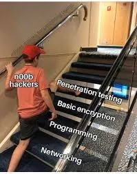
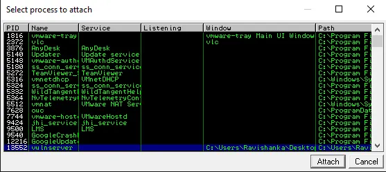
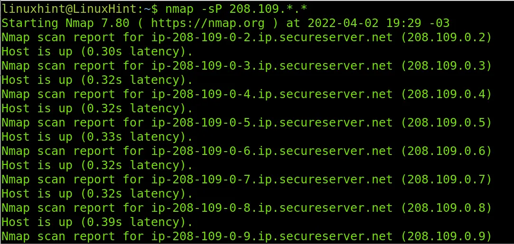
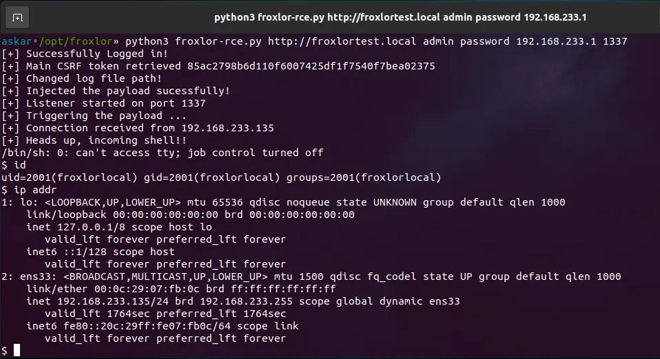
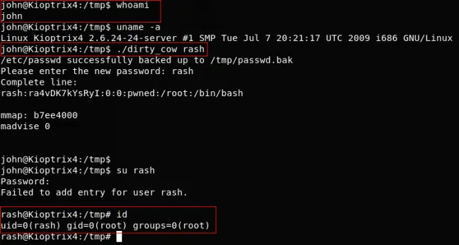
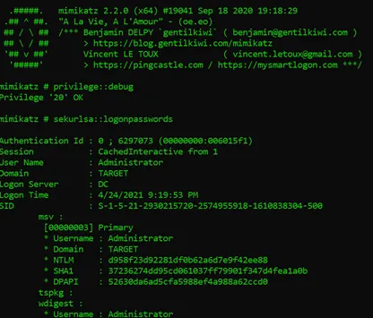
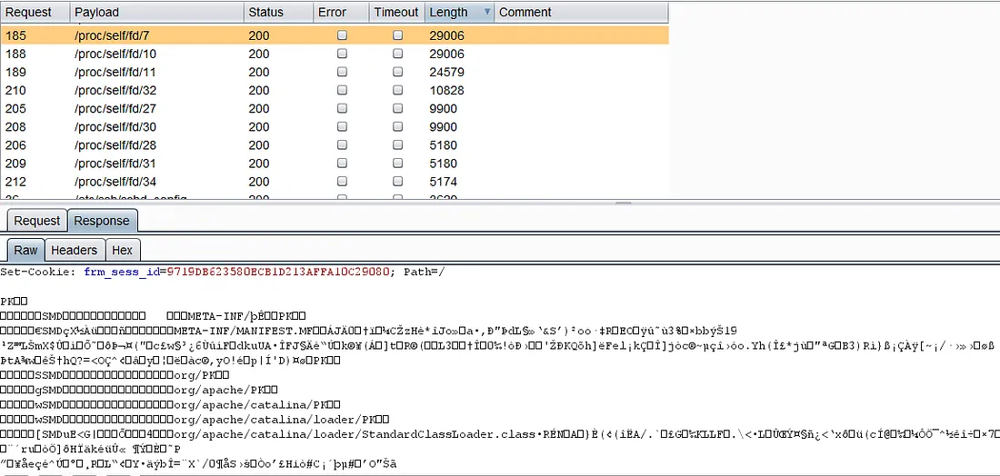
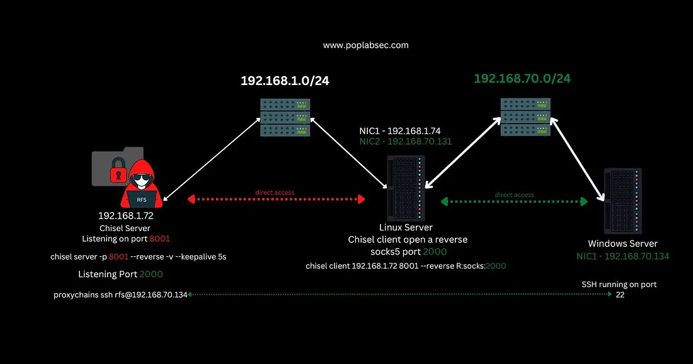
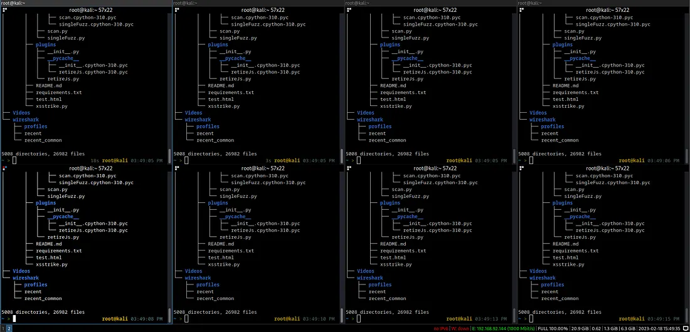

The Offensive Security Certified Professional (OSCP) certification is one of the most well-respected and challenging certifications in the cybersecurity industry. As a practical certification, it requires one to demonstrate proficiency in penetration testing through an intensive 24-hour exam. The OSCP exam is known for its difficulty, and many people struggle to pass it on their first attempt [Thank you ChatGPT].

In this blog post, I will try my best to guide you through the OSCP minefield and provide you with tips, strategies, and resources to help you pass the exam on your first try. Whether you are a beginner or an intermediate hacker (like me), this guide will give you the information and confidence you need to succeed.

## Table of Contents

- [Why would I wanna do the OSCP in the first place?](#why-would-i-wanna-do-the-oscp-in-the-first-place)
- [How do I get started? [P4r7 1]](#how-do-i-get-started-p4r7-1)
  - [Operating System Internals](#operating-system-internals)
  - [Computer Networking](#computer-networking)
  - [Programming](#programming)
- [How do I get started? [P4r7 2]](#how-do-i-get-started-p4r7-2)
  - [The Command Line](#the-command-line)
- [How hard is the OSCP material?](#how-hard-is-the-oscp-material)
- [Should I do any certifications like Security+ or eJPT before jumping into OSCP?](#should-i-do-any-certifications-like-security-or-ejpt-before-jumping-into-oscp)
- [What should I focus on? Windows or Linux? Buffer Overflows too maybe? Web stuff?](#what-should-i-focus-on-windows-or-linux-buffer-overflows-too-maybe-web-stuff)
- [What are the best resources for everything?](#what-are-the-best-resources-for-everything)
  - [For Enumeration](#for-enumeration)
  - [For any kind of initial access vector](#for-any-kind-of-initial-access-vector)
  - [For Reverse Shells](#for-reverse-shells)
  - [For Privilege Escalation](#for-privilege-escalation)
  - [For Other Stuff](#for-other-stuff)
  - [Platforms to practice on](#platforms-to-practice-on)
- [What should be my methodology for hacking stuff (for OSCP at least)?](#what-should-be-my-methodology-for-hacking-stuff-for-oscp-at-least)
  - [Enumeration](#enumeration)
  - [Exploitation](#exploitation)
  - [Privilege Escalation](#privilege-escalation)
  - [Post Exploitation](#post-exploitation)
  - [Reporting Stuff](#reporting-stuff)
- [I hate manually doing SQL Injections. How do I resist the temptation of SQLMap?](#i-hate-manually-doing-sql-injections-how-do-i-resist-the-temptation-of-sqlmap)
- [I have an LFI but I find it hard to get an RCE or some form of command injection. What to do in these cases?](#i-have-an-lfi-but-i-find-it-hard-to-get-an-rce-or-some-form-of-command-injection-what-to-do-in-these-cases)
- [Buffers Overflows are really hard. I am worried about it. What to do?](#buffers-overflows-are-really-hard-i-am-worried-about-it-what-to-do)
- [I have heard and seen people chain exploits like it's obvious to them. How do I gain that kind of intuition?](#i-have-heard-and-seen-people-chain-exploits-like-its-obvious-to-them-how-do-i-gain-that-kind-of-intuition)
- [I hate pivoting. Is there an easy way to do it for AD?](#i-hate-pivoting-is-there-an-easy-way-to-do-it-for-ad)
- [Any tips to speed up my workflow while hacking stuff?](#any-tips-to-speed-up-my-workflow-while-hacking-stuff)
- [4nY h4X0r 71Pz?](#4ny-h4x0r-71pz)
- [How did you prepare for the exam?](#how-did-you-prepare-for-the-exam)
- [How was the exam?](#how-was-the-exam)
- [Exam Tips?](#exam-tips)

> **Note** — The structure of this guide will be in the form of questions and answers. I will start from questions that generally stem from a beginner's POV and move onto the intermediate/1337h4X0r mindset of going about this. I shall also refer existing information from guides and blogs. I must mention that videos I link here have playlists containing them so be sure to find them through YouTube yourself (this is a skill I want everyone reading this to pick up. OSINTing one's way through life on the internet). ALSO THIS IS GOING TO BE LONG :)))))

> **Bigger Note** — This guide is not a one-shot deal to pass the OSCP but I want to make it a decent reference. Therefore, this guide will be updated with new information if I come across anything potentially important to mention.

So let's get started on your journey to becoming an OSCP :)

---

## Why would I wanna do the OSCP in the first place?


As stated in the introduction itself, OSCP is one of the most well-respected certifications in the field of Offensive Security (Apparently so. I still don't have Summer Internships with it). If you are at all interested in penetration testing (hacking and breaking stuff), then the OSCP teaches you a lot of things that come along with that.

In the process of preparing for the exam, you also learn the mindset of "Trying Harder" and get a better command at operating the command line (It's black-and-white terminal stuff you see in movies). Building upon the skills you gain from doing the course accompanying the exam, you can be exactly like the guy in the image above (or worse). If you like to look for faults and exploit those faults in stuff, you would probably make a great hacker (and also a villain).

---

## How do I get started? [P4r7 1]

Probably the most common question on this topic. Most people would agree with me that in order to even understand the course material (with enough depth and understanding), you need to understand basic topics like Computer Networking, Operating System internals (a bit), and Programming (also a bit). DO NOT be the guy below. You will suffer. 100%.



A lot of people/guides recommend studying for the Security+ exam and gaining some proficiency at least with Computer Networking and Operating System internals (via stuff like CCNA, Network+, A+ and whatnot). And I agree. It is almost necessary to have some grasp of those concepts.

I did not do the Security+ (or any other certifications like that) but instead, I had a whole degree in Computer Science and Engineering to help me with those topics. However, there are loads of resources for understanding what's required without getting a degree.

### Operating System Internals

For operating system internals, the starter video can be -

**Crash Course Computer Science** — I love Crash Course videos and they are great at getting you interested in putting your foot in. They also don't cover too much technical detail so it's not obfuscated nerdy verbiage.

<iframe width="560" height="315" src="https://www.youtube.com/embed/26QPDBe-NB8" title="Operating Systems: Crash Course Computer Science" frameborder="0" allow="accelerometer; autoplay; clipboard-write; encrypted-media; gyroscope; picture-in-picture" allowfullscreen></iframe>

For advanced stuff after watching videos like the Crash Course one -

**Neso Academy** — This playlist by Neso Academy goes into much more detail on Operating System Internals (Yes it's a playlist. Like I said. OSINT it up. Easiest OSINT ever) compared to the Crash Course one and it was one of the first playlists I actually dug through while doing a course on "Operating Systems" in my undergrad.

<iframe width="560" height="315" src="https://www.youtube.com/embed/videoseries?list=PLBlnK6fEyqRiVhbXDGLXDk_OQAeuVcp2O" title="Neso Academy Operating Systems Playlist" frameborder="0" allow="accelerometer; autoplay; clipboard-write; encrypted-media; gyroscope; picture-in-picture" allowfullscreen></iframe>

If you want to spend a lot more time with Operating Systems, do check out the following video (again a part of a playlist) -

**GATE Smashers** — He goes into depth on the level of GATE (Passing this exam in India allows you to do a Masters in Engineering. It's known to be somewhat tough) on operating system concepts but also numerical-like problems. I wouldn't go too deep into this but this guy helped me a lot while preparing for some exams (and understanding stuff).

<iframe width="560" height="315" src="https://www.youtube.com/embed/videoseries?list=PLxCzCOWd7aiGz9donHRrE9I3Mwn6XdP8p" title="GATE Smashers Operating Systems" frameborder="0" allow="accelerometer; autoplay; clipboard-write; encrypted-media; gyroscope; picture-in-picture" allowfullscreen></iframe>

If you want a more interesting take on Operating Systems look no further than this -

**Brian Will** — Brian Will has had some controversial videos (He disses the way Unix has evolved and why Object-oriented programming sucks. You can learn what those words are eventually but they are not too important) but I like how he explains stuff. If you want another good source, Brian Will is the guy.

<iframe width="560" height="315" src="https://www.youtube.com/embed/videoseries?list=PLIbUZ3URbL0Gqn0q2-MYJd-3nv6zw7GCQ" title="Brian Will Operating Systems" frameborder="0" allow="accelerometer; autoplay; clipboard-write; encrypted-media; gyroscope; picture-in-picture" allowfullscreen></iframe>

If you are more interested in niche areas of operating systems, be sure to just search `<topic name> computerphile` on YouTube and you will probably find something interesting. Do your own research otherwise (Read papers if you want. Find courses to do).

Let's move on to resources for Computer Networking -

### Computer Networking

Yet again, for absolute beginners, this is the best introductory video on the topic -

**Crash Course Computer Science** — You can tell that I quite like Crash Course and it's for a reason. Please do watch it.

<iframe width="560" height="315" src="https://www.youtube.com/embed/3QhU9jd03a0" title="The Internet: Crash Course Computer Science" frameborder="0" allow="accelerometer; autoplay; clipboard-write; encrypted-media; gyroscope; picture-in-picture" allowfullscreen></iframe>

For a much longer in-detail coverage of Computer Networking, this is probably the best video on it -

**freeCodeCamp** — This video is by freeCodeCamp (great tutorials on just about anything relevant/broad in Computer Science) and they cover material that comes into Network+ (it's like the Computer Networking equivalent of Security+. Or so I have heard). I haven't seen the complete video (it's 9 hours+) but I have seen a lot of sections within this video since it's straight to the point.

<iframe width="560" height="315" src="https://www.youtube.com/embed/qiQR5rTSshw" title="Computer Networking Course - Network Engineering (CompTIA Network+)" frameborder="0" allow="accelerometer; autoplay; clipboard-write; encrypted-media; gyroscope; picture-in-picture" allowfullscreen></iframe>

### Programming

This is a topic I don't think you need to drone on too much but it helps A LOT. You don't need to learn any "difficult" languages like C or Java (well I think they are more annoying than difficult). You just need to learn how to read code and modify it according to your whims.

If you do want to learn some programming, please start with Python. If you want to try harder at the outset, then go for learning C and nothing else.

For Python, Charles Severance is probably the best guy I know teaching it. He has a full-length YouTube video and a Coursera course on Python. The links to all of them are on the link below -

**Python for Everybody** — This website is building a set of free materials, lectures, books and assignments to help students learn how to program... [www.py4e.com](https://www.py4e.com)

<iframe width="560" height="315" src="https://www.youtube.com/embed/8DvywoWv6fI" title="Python for Everybody - Full University Python Course" frameborder="0" allow="accelerometer; autoplay; clipboard-write; encrypted-media; gyroscope; picture-in-picture" allowfullscreen></iframe>

If you want to learn C then the following video should be enough for OSCP -

**freeCodeCamp C Tutorial** — C is actually much more nuanced than what's covered in the above video but it's good enough.

<iframe width="560" height="315" src="https://www.youtube.com/embed/KJgsSFOSQv0" title="C Programming Tutorial for Beginners" frameborder="0" allow="accelerometer; autoplay; clipboard-write; encrypted-media; gyroscope; picture-in-picture" allowfullscreen></iframe>

> There's a lot of stuff on YouTube and these are just some examples. There are plenty of books on the topic as well but I don't know too much about them. You can always look that stuff up but I genuinely think videos are more engaging while you are trying to learn a topic as a beginner. Feel free to refer books if you like but do try to program some examples on your own. No point to theory without application.

I think enough resources for Programming have been covered and I think this point needs to be stressed again.

**You generally only need to UNDERSTAND and MODIFY code and nothing much beyond. It surely HELPS to learn to program but it's not necessary. At least I don't think so. If you DONT understand what a certain part of code is doing, always GOOGLE it. For anything at all, just GOOGLE. Errors? GOOGLE.**


I am even going to put an image of l33t google here. For anything you don't understand, the first step must always be to ______.

I hope I got my point across.

---

## How do I get started? [P4r7 2]

We covered the fact that knowing Operating System Internals, Computer Networking and some programming definitely helps in prepping for OSCP and understanding the material provided on the portal. But what next? You know what memory is and you know what an IP address is and you also know what the following code does -

```python
import random

def doessomething(what):
      ummmmm = [ord(i) for i in what]
      okthen = [i + random.randint(1, 10) for i in ummmmm]

      weirdstuff = ''.join([chr(i) for i in okthen])

      return weirdstuff

what = "whatisthisdoing"
weirdstuff = doessomething(what)
print(weirdstuff)
```

Great. Now what? Dive into OSCP material and swim in it?

**Nope**

As a complete beginner, the very first thing after all that should be to learn how to **uz3 7H3 KOmmANd L1n3.**

### The Command Line

Let's be real. You don't always get a Graphical Interface for whatever you might want to do. You have a browser to go through web pages. You maybe find something to exploit and maybe you can run commands through the browser.

But what if there's nothing like that?

A lot of tools you would be using for hacking stuff do not have a GUI (Graphical User Interface). Nmap has Zenmap but the Impacket Suite doesn't. There are a lot of cases where knowing how to use the command line just helps and is much more efficient. You also have more granular control compared to the black box that is the GUI (Not that much of a black box. But compared to its CLI version, it's a lot).

While the OSCP material does cover how to use the command line, I think it's still pretty daunting for a beginner.

A great playlist that gets you started has to be from NetworkChuck's-

<iframe width="560" height="315" src="https://www.youtube.com/embed/videoseries?list=PLIhvC56v63IJIujb5cyE13oLuyORZpdkL" title="Linux for Hackers - NetworkChuck" frameborder="0" allow="accelerometer; autoplay; clipboard-write; encrypted-media; gyroscope; picture-in-picture" allowfullscreen></iframe>

Love NetworkChuck and his energy. Easily one of the greatest YouTubers on the subject of Cybersecurity. He, David Bombal, and John Hammond are my favourites in the field. They are great for beginners and are also great for advanced use cases.

Ok, now you also know how to use the command line. You know how to move around directories, look for files, open a text editor and edit stuff in the terminal, download stuff and whatnot.

### Is there anything else left at this point?

Nope, not really. But I think something very crucial is missed out despite all that has been said.

```
BB91NL5qEBVliL8lZKOGV1WOV0ZzNKAYWXGCfB5pg3ieNLKzEHGRfB51jH4lW
L8lh3W1ErDlgLqwEXGeECW0fB5sNMAbNLJlirqdiMAmgHGyDBStfB5qQnGLfCl
lECOdg3OeNMqaiXGrDBSqQnGLfCllfCSeiBAeNMqaiXGrDBSqQnGREBKdgnGtg
3hliL8lgL9afdGrg3NlfB5rg3OyDCWug24ljB91hsSqgLDzNJcqDCOzNLmaidG0gdG
Mg29sgLZzNJKbhLc5NMWtEB9djXGugnGbhrKoiLqoEX4lZ2AqNMWtEXGog25o
ECG0hdG5g3ZlgLAmhr5qEHGmDr91iHGugnG2fBWqg3RlDB5pNLOqNLKngLZli
L8lD29dhrAxDCWqNMiuiLlli2mmiHG5g3ZlDCOqNLWafB5sQnF=
```

Decrypt the above string using -

**CyberChef** — The Cyber Swiss Army Knife - a web app for encryption, encoding, compression and data analysis [gchq.github.io](https://gchq.github.io/CyberChef/)

The string is encrypted with a certain shift of a cipher called ROT13 (Shift to decrypt is bigger than 13) and is subsequently encoded with something called "Base64". A small CTF challenge to ingrain the idea embedded in that string. Have fun with it.

---

## How hard is the OSCP material?

It's not too hard but it's not easy either. The exercises Offsec provides are not that easy to solve. They take time and effort but you learn more than you would think. There's a lot of info covered. A lot of the exercises are annoying too so the struggle forces you to learn too.


With Offsec's new rule of bonus points (at least at the time I am writing this), you no longer have to make a lab report on the exercises you did for 10 points. I still think it's worth the effort of documenting everything you did. You learn more and retain more with that effort. I felt like I actually wasted my time doing the report (as soon as the new rule came out), but it was actually very helpful. So please do it.

Unlike me, you will have to most likely make notes. I have used Obsidian, CherryTree, Joplin, SimpleNote and others. You can use whatever you want. Notion. Evernote. Some Markdown editor or whatever. Use anything that you are comfortable with.

Note down command line things you did. What some concept means in short. How you absolutely annihilated an exercise/machine that you think may be relevant for the exam. Document your attack paths. More the notes, the better (I didn't use my notes at all but I am me. You are you).

So in a nutshell, it's not a walk in the park. You will 100% struggle. You will fall. But do not forget to get up. The worst thing to do while prepping OSCP is to give up.

> Take breaks not give up. Do the work and you will be fine. You do not have to be a genius. I am certainly not one.

---

## Should I do any certifications like Security+ or eJPT before jumping into OSCP?


*https://pauljerimy.com/security-certification-roadmap/*

The syllabus covered in Security definitely helps in laying down foundational topics/concepts for Cybersecurity in general. A lot of it is applicable to the foundations of OSCP. Before starting with granular details, Security+ helps one to see the bigger picture of things. Meanwhile, OSCP inevitably deals with the details as it's a technical exam.

Doing something like Security+ before doing OSCP is a sound idea. You don't even need to necessarily pass the exam as long as you go through the material and understand it on your own terms.

Meanwhile doing something like eJPT is obviously much more fruitful. I have not done it myself but looking at the material covered in the INE videos (just seeing the contents), it's obviously a far better investment compared to certifications like Security+ and Network+. If you have your basics in line, jump into eJPT instead of wasting time on the CompTIA certifications.

Also, I do not recommend something like CEH either since it's worse than all the other certifications mentioned above. It's eye candy for hiring managers allegedly, but I would not go for it in terms of prepping for OSCP.

There are loads of much cheaper courses that can get you started with Ethical Hacking itself. A great example is [Zaid's course on Udemy](https://www.udemy.com/course/learn-ethical-hacking-from-scratch/).

There's a load of decent Udemy courses that cover the basics of hacking at least and the concepts associated with that. Don't waste your money just to get a certification. Look through the content covered and compare it to the OSCP syllabus yourself. See what you already know and what you need to learn. Don't chase certifications.

---

## What should I focus on? Windows or Linux? Buffer Overflows too maybe? Web stuff?


*A snap from ImmunityDebugger cuz why not*

To just operate/hack, learning how Linux works deeply is the first thing you should do. This applies to OSCP exercises you might do or just practicing stuff.

Right after that, your focus must be Initial Access (yes web stuff is included). Without any way of getting in, it doesn't matter what the operating system is (technically it does but you get the idea).

**BUT, if you have a decent command over operating Linux for doing stuff (initial access included), I would say put more effort into learning how Windows works. Especially the exploit chains (from Initial Access to Privilege Escalation).**

Exploiting Windows is generally much tougher than Linux (at least in my experience but it is of course quite relative). A MAJOR chunk of the points needed to pass involves Active Directory (which again uses Windows).

Before diving into Active Directory (an even more complex topic), you must understand how Windows works.

I would even go as far as to say that the end goal should be to know how to hack Windows better than Linux (at least for OSCP). In my opinion, Linux is usually easier (even on platforms like ProvingGrounds and the Offsec Machines provided).

> It's always the enumeration phase causing headaches.

Beyond that, Buffer Overflows are pretty daunting to beginners, but it is not something to skip at all. Some people I have talked to, have had exam machines feature it. It's rare but I have heard it happen. Don't skip out on anything.

In summary, focus on how to use Linux properly, how to get in and Active Directory/Windows. The rest is not that important (in my opinion).

---

## What are the best resources for everything?

### For Enumeration

[https://blog.certcube.com/oscp-enumeration-cheatsheet/](https://blog.certcube.com/oscp-enumeration-cheatsheet/)

### For any kind of initial access vector

**HackTricks** — Welcome to the page where you will find each hacking trick/technique/whatever I have learnt from CTFs, real life apps... [book.hacktricks.xyz](https://book.hacktricks.xyz/)

Literally. If you think there is something called an SSTI? Google `ssti hacktricks`

You found a service called `MiniServ 1.890` (`Webmin` httpd)?

Google it and append "exploit" to your search. You can find public exploits or at least a blog on how to exploit stuff like this.

If you don't want to google exploits, just do this on your Kali Linux CLI (idk if it's installed by default otherwise) -

```bash
searchsploit apache
```

There will be some EDB-ID or something in the output. To get the script just do this -

```bash
searchsploit -m <EDB ID>
```

Ez pz. But of course, searching for things is the real skill needed here and executing what you find. You learn stuff like this with practice and experience.

### For Reverse Shells

**Online - Reverse Shell Generator** — Online Reverse Shell generator with Local Storage functionality, URI & Base64 Encoding, MSFVenom Generator, and Raw... [www.revshells.com](https://www.revshells.com/)

### For Privilege Escalation

Same thing. You can find most of what you need on HackTricks. But then again there should be a checklist of what you can look for. Some of them are -

**Linux**

[PayloadsAllTheThings](https://github.com/swisskyrepo/PayloadsAllTheThings/blob/master/Methodology%20and%20Resources/Linux%20-%20Privilege%20Escalation.md) (There is a link here. Hover your mouse on it)

**Checklist - Linux Privilege Escalation** — Checklist - Local Windows Privilege Escalation [book.hacktricks.xyz](https://book.hacktricks.xyz/linux-hardening/linux-privilege-escalation-checklist)

**Windows**

**Checklist - Local Windows Privilege Escalation** — Checklist - Local Windows Privilege Escalation [book.hacktricks.xyz](https://book.hacktricks.xyz/windows-hardening/checklist-windows-privilege-escalation)

**Checklist - Local Windows Privilege Escalation** — https://book.hacktricks.xyz/windows/windows-local-privilege-escalation#kernel-exploits [oscp.infosecsanyam.in](https://oscp.infosecsanyam.in/)

For Linux, the best thing is running linPEAS. For Windows, it's winPEAS. But there are many more scripts for the same thing. For Active Directory, adPEAS and BloodHound (a little annoying to use sometimes) are great.

### For Other Stuff

**Buffer Overflows for OSCP**

**TryHackMe | Buffer Overflow Prep** — Practice stack based buffer overflows! [tryhackme.com](https://tryhackme.com/room/bufferoverflowprep)

**Pentest-Cheatsheets/buffer-overflows.rst at master** — There are generally two ways to use Immunity Debugger to debug an application: Make sure the application is running... [github.com](https://github.com/Tib3rius/Pentest-Cheatsheets/blob/master/exploits/buffer-overflows.rst)

**Machines to Practice on**

**NetSecFocus Trophy Room - Google Drive** — Edit description [docs.google.com](https://docs.google.com/spreadsheets/u/1/d/1dwSMIAPIam0PuRBkCiDI88pU3yzrqqHkDtBngUHNCw8/htmlview)

**Active Directory**

[My favourite cheatsheet](https://wadcoms.github.io/) (Hover your mouse here)

**One of the Best Overall Cheatsheets Out There**

**OSCP personal cheatsheet** — Wordpress panel RCE Username enumeration Drupal panel RCE Default credentials Brute force Tomcat panel RCE HTTP basic... [liodeus.github.io](https://liodeus.github.io/2020/09/18/OSCP-personal-cheatsheet.html)

My top favourite^ (I didn't use it much though honestly. Not an overall cheatsheet kind of guy)

**OSCP Cheatsheet** — OSCP Cheatsheet General Enumeration - Nmap Replace $ip with target IP Initial scan nmap -Pn -n -vvv -oN nmap/initial... [www.noobsec.net](https://www.noobsec.net/)

> **Note** — While these cheatsheets are great by themselves, your own notes may prove to be even more helpful. Be sure to make notes for yourself on all these domains.

**TryHackMe | Compromising Active Directory** — Approximately 90% of the Global Fortune 1000 companies use Active Directory (AD). If an organisation's estate uses... [tryhackme.com](https://tryhackme.com/room/introtoad)

The above module in TryHackMe walks you through what AD is all about. How you can breach AD, escalate privileges and pivot around. Absolutely recommended. If you want go above and beyond, also do the **Red Teaming Learning Path**.

### Platforms to practice on

**TryHackMe | Cyber Security Training** — TryHackMe goes way beyond textbooks and focuses on fun interactive lessons that make you put theory into practice... [tryhackme.com](https://tryhackme.com/)

I genuinely believe TryHackMe to be the best for beginners. If you are somewhat of a beginner myself, do as many free rooms as you can. Once you start feeling comfortable with the easy-medium difficulty of machines, slowly move onto the real deal that is HackTheBox and ProvingGrounds.

If you don't like watching too many videos like I suggested above, go for the **Pre Security Learning Path**, **Introduction to Cyber Security Learning Path** and the **Complete Beginner Learning Path**.

To move onto Pentesting/OSCP type stuff, do it in this order —

> Pentest+ Learning Path → Jr. Penetration Tester Learning Path → Offensive Pentesting Learning Path → Red Teaming (not necessary at all but would help)

Beyond these learning paths, start with the easy-level challenge machines and slowly move on to the Medium ones. In my opinion, if you are comfortable with the Medium machines at some point, OSCP becomes at least 40% easier (an intuitive number I am throwing out here).

If you are able to do the hard ones comfortably, then you sit around 70–80% easier (of course I am including the Active Directory machines on THM as well).

**Offensive Security** — Edit description [portal.offensive-security.com](https://portal.offensive-security.com/)

**Proving Grounds Play** is said to have machines previously used in past OSCP exams so it is definitely worth the price. The machine by themselves are also challenging and fun. After giving the OSCP, I can easily say that the Proving Grounds Play platform (and of course the Offsec Labs themselves) will be the best starting point after TryHackMe's beginner learning paths.

**Hack The Box** — Edit description [app.hackthebox.com](https://app.hackthebox.com/)

For **HackTheBox**, make sure to refer to TJ Nulls list on everything. There are some retired machines on the list and you may need to buy a premium VIP subscription for it. I barely did like 10–20 machines on the list but the more practice, the better (as usual).

Currently, I am able to complete medium machines with relative ease. In my opinion, if you do reach this point, you have a much higher chance of passing OSCP. Of course, if you are able to do Dante's Pro Lab and the other Active Directory Pro Labs, you will be a beast (I only completed Dante's Pro Lab. It's pretty good prep if you wanna shill some money).

---

## What should be my methodology for hacking stuff (for OSCP at least)?


Here are the steps to a methodology of hacking stuff (at least on the level of OSCP) ->

> **Note** — I shall also be mentioning tools I generally use and what you should not use for the exam as well. This part will be especially instrumental to your journey.

### Enumeration


Always enumerate until you wanna strangle yourself. Seriously though. This is not a joke. Enumerate even if you think you already know the answer. It will be well worth the time, trust me. Enumeration will be the key to everything you do for OSCP. It's THE skill and I would also say that it's THE hardest part of the exam as well.

This part will be especially instructive for your journey.

**Sup?**


Suppose you have a subnet of IPs. This is the widest case you will encounter. In that case, your first step would be to do a couple of scans to see what's up or down.

First, you would try a ping scan. Then try other scans. Maybe an ARP scan. Maybe do a traceroute to all those IPs within the subnet. You can try the various variants of TCP/UDP scans (Full TCP connect handshake scans/XMAS scans/FIN scans/SYN scans). You can use Nmap for all this.

**What's in here?**



Now you know what IPs are up. Let's assume you are focusing on a single IP for now. Now you would try to see what's open. What ports are there? What services are on them?

> *Note — In case you are paranoid and feel that the ping scans and whatnot gave false negatives, then make sure to scan for open ports on the subnet again using something like* `nmap --open -- top-ports 20`*.*

For some of the fastest scans possible on TCP ports currently, my best bet has always been **RustScan** ([Link here](https://github.com/RustScan/RustScan)).

As the GitHub Repo's README claims, it truly is blazingly fast. Just to scan ports, I use always run RustScan on an IP. You can also do subnet ranges if you want.

As for UDP, you have no other choice but to use Nmap and scan real slow. I normally do not see any usable UDP ports. But, it does not hurt to scan for them in the background (even during the exam). I did not scan for UDP ports during my exam and didn't report them either and I still passed.

**Something looks weird**

This topic is more related to CTFs but you never know. If the Nmap scan is giving you weird results (taking way too long to scan and whatnot or maybe the ping scans and whatnot make negative) then make some of the following changes (just in case).

Add `--min-rate 4000 --max-rtt-timeout 100ms` (which tells Nmap to scan faster) OR add `Pn` to bypass the host discovery (and check for open ports without checking whether the host is up first.

**Alright, now I know what ports are there on some IP 10.10.2.3. What's on those ports?**

Do a Nmap scan as usual but now with the `-sV` flag. If you want to run some default Nmap scripts also use the `-sC` flag. Always add verbosity with the `-vv` flag as well.

If you see loads of ports consisting of numbers such as 135, 139, 445, 389, 636 and the likes, you are most likely looking at an Active Directory domain machine. You might even see hints about the domain name used for that particular machine in the nmap output.

**25 (SMTP)**

Usually the exploit I see on this port features some kind of RCE payload within a created mail. Or maybe some form of log poisoning. Usually, search Google for this port and what you can do given the version.

**Stuff like FTP and SMB? Lovely**

Try anonymous logins on any open FTP/SMB services. See if you can access stuff. Check their versions. Check if there is an exploit online using whatever you got from Nmap. If you found any credentials, do not forget to test them against SMB/FTP like services.

**80 and 443. Kind of Lovely**

Now let's suppose you found a website of some kind. Check what's used. Check for versions. Check if there is an exploit online using `searchsploit` or just Google.

If you found nothing online directly, browse through the website. What can you see? Open every link on there. Check the source by right-clicking on the page and clicking `View page source`

See if there are any hidden endpoints on the page sources. Some open folders you can access. Check robots.txt and sitemap.xml to see endpoints that are hidden from plain sight.

Bruteforce directories using tools such as `ffuf`, `gobuster`, `dirsearch` and use different wordlists present by default on Kali (such as `directory-2.3-medium.txt`, `big.txt` and others)

Explore whatever you found. Check if there are any places you can give your input. There might be an SQL Injection/SSRF/RCE command injection/SSTI whatever. Try everything from cheatsheets online (Hacktricks/PayloadsAllTheThings or just googling).

**But DONT use tools like SQLMap, SSTIMap or anything that automates exploitation. These are strictly banned to use in the exam. Develop a habit to do stuff manually.**

**88? Kerberos Et Tu Brute**

You can try Impacket scripts like GetUserSPNs.py, GetNPUUsers.py (for AS-REP Roasting), Kerbrute.exe's various modules.

**LDAP/LDAPS**

*This is left as an exercise to the reader (I hate LDAP). Lots of resources on LDAP though. Google and you will find exactly what you need.*

**Something Unknown**

You didn't get a particular name of the service using Nmap. Whatever you got isn't available on Google? Use netcat to connect to it like this -

```bash
nc <IP> <weird port>
```

You might see some header pop out or some other information. Maybe it's a custom service with no public exploit. Interact with it and see what it does. Try inputs that you think can generate something. Open it in the browser, maybe Nmap was too dumb to get it.

### Exploitation



You found a public/manual exploit (could be LFI to RCE/SSRF to RCE/RCE through Command Injection/Credentials using SQLI Injection whatever) and can run commands on the server. It could be a Python/Perl/C/Ruby/PHP/JS script or just a README with steps. Learn how to making modifications and utilizing them effectively.

**Linux**

On Linux, you can use the `nc mkifo` version of getting the reverse shell (check revshells.com and use URL encoding if you are doing stuff through BurpSuite or just your Browser).

Don't have `nc` on the system? Try using `curl` or `wget` to download a static netcat binary to the system (URL encode as usual) and run it using command injection (again URL encode). Host using `python3 -m http.server 80` or `updog` or placing stuff in `/var/www/html` and running `systemctl start apache2`

Many many methods out there.

Oh you don't even have `curl` or `wget`?

That makes stuff harder. On Windows, there are many other ways of getting stuff on your system. Google around. You will find methods using `certutil.exe`, PowerShell's `System.Net.WebClient` method, using VBS scripts to download etc.

On Linux, you would have to use netcat/something else to transfer files (*how you do this is left as an exercise to the reader again ;)*)))

For catching reverse shells on Linux, be sure to use `pwncat-cs`

I absolutely love `pwncat-cs` and still use it regularly. The normal `nc` shell sucks and you have to do weird upgrading tricks to make it work interactively without breaking and it's annoying.

**Windows**

But for Windows, `pwncat-cs` usually doesn't work. Your best chance is to use a C2 framework like PowerShell Empire or Meterpreter (not stuff like Covenant and Cobalt Strike because it's banned I think) but Meterpreter is not allowed for use for more than one machine. Don't develop a habit of using Metasploit/Meterpreter since you can't use it in OSCP regularly. PowerShell Empire is allowed so you can use that.

I normally go for a netcat shell honestly (Look into something called `ConPty` for a more stable shell). If I want a quick shell without the `ConPty` benefits, I just use `rlwrap` around my netcat shell as it makes my life easier. If you can get RDP access, that's even better but usually, you don't get that straight away. In Active Directory cases, you do usually get it (or you can enable RDP and add some user to a group that allows RDPing).

**Active Directory**

The Impacket Suite and Rubeus are your best friends. Otherwise, typical Windows Privesc or Initial Access methods often apply. Be sure to understand the manual exploitation that is covered by Offsec's modules. They help you gain a better understanding of why some Impacket scripts might not be working and what key variables you are forgetting/ignoring.

### Privilege Escalation



This is my favourite part of hacking into stuff. Especially in Linux. For Linux/Windows, be sure to check your current directory for anything.

**Linux**

In Linux, make sure to check sudo permissions using `sudo -l` and check for SUID binaries (there is a certain find command for this ;) ).

An underrated technique for getting more information on what your current user can do and use is using `find / -user <current-user> -group <current-group> 2>/dev/null`.

If you don't find anything by those steps, feel free to fire up privesc scripts like `linPEAS` or whatever else works for you. I typically don't use anything beyond `linPEAS`. Be sure to check open services on open ports locally as well and check running processes. Check cronjobs. The usual shenanigans of poking around a Linux file system.

Something not often covered unless done is running `PsPy` for a while on the local system. Sometimes you have scripts running as cronjobs as root (which you cannot see without `PsPy`).

As a last resort, use kernel exploits by checking the kernel version using `uname -a`.

**Windows**

Windows is a little more annoying privesc-wise (in my opinion), but winPEAS does a really good job of finding what you need generally speaking. But beyond that, you should check all scheduled tasks, services, processes, your permissions/privileges, special registry entries (you will know about them while studying the OSCP material) and what you can access (using `icacls.exe`).

If you have something like SeImpersonatePrivilege you can directly get SYSTEM privileges. It usually works and is like the PwnKit of Windows.

**GitHub - ohpe/juicy-potato: A sugared version of RottenPotatoNG, with a bit of juice, i.e. another...** — A sugared version of RottenPotatoNG, with a bit of juice, i.e. another Local Privilege Escalation tool, from a Windows... [github.com](https://github.com/ohpe/juicy-potato)

Lovely tool honestly.

For privesc on both kinds of operating systems, Tib3rius has great courses. Be sure to check them out.

[His account on Udemy](https://www.udemy.com/user/youracclaim-1/) (Hover your mouse here for the link).

For everything else (kernel exploits and whatnot), Google as usual.

**Active Directory**

Pass-the-hash/Pass-the-ticket and credential harvesting are your best friends here. Otherwise, the same Windows privesc methods apply. There are other methods covered as well but I don't think anything beyond these 3 attacks is that common. But it's always good to be prepared so do try HackTheBox AD machines (medium-hard; they are on TJ Nulls list) to learn about more vectors (stuff like abusing GPOs/ACLs and using lovely binaries such as `takeown`).

### Post Exploitation



**Linux**

In Linux, generally, post-exploitation involves dumping /etc/shadow or credentials from places or looking for other endpoints to pivot to. Usually not much on Linux machines (at least in my experience)

**Windows**

In Windows, mimikatz is your best friend for post-exploitation stuff. You can dump hashes, impersonate users, and escalate privileges to SYSTEM from administrative privileges. You can try various persistence methods as well but that's not that important to learn (for OSCP at least. It does help if you have to reboot [not reset] the system in unforeseen circumstances/for privesced backdoors).

**Active Directory**

Bloodhound, Rubeus, PowerView, and Mimikatz, again are your best friends here. PowerView especially needs some experience to understand its use and also requires an understanding of how Active Directory structures domains, domain users, their ACLs, their permissions, GPOs and whatnot work so that you can leverage them for your purposes.

BloodHound is not that hard to use but the paths may not be extremely clear immediately. Even if some path is clear, the abuse mechanism may not work as listed in BloodHound. So you have to experiment usually and google around for what that type of abuse features and does. It's all about research and Active Directory is very well-researched so you are likely to find a blog or a machine writeup that features what you want to do.

Pivoting in Active Directory can be a pain if you don't have direct RDP access to internal machines. I shall cover a bit of pivoting in a question's answer in this blog's future.

### Reporting Stuff

**The most important step after hacking stuff.** If possible, create writeups for everything you do internally (you don't need to necessarily create a blog for every machine). Take notes on what you did (I didn't). In your exam/lab report, be sure to take proper screenshots and paste actual commands (yes full commands). Also, include the entire scripts if you make any modifications and highlight them. Make clear headings and format them properly as well. Grammar and spelling should also be nearly perfect.

[OSCP's official template for the report](https://www.offensive-security.com/pwk-online/OSCP-Exam-Report.docx) (Hover for Link)

You can also check this blog for a much more comprehensive methodology guide -

**OSCP: Developing a Methodology** — I've been asked several times on Discord to create a post regarding my methodology and how to establish one. Mainly the... [falconspy.medium.com](https://falconspy.medium.com/oscp-developing-a-methodology-32f4ab471571)

---

## I hate manually doing SQL Injections. How do I resist the temptation of SQLMap?


I feel you. I used SQLMap for a good amount of time and it didn't do me well. I was not able to do even simple SQL injections that bypass authentication. I could not even dump the SQL version without help. I was that bad.

The only way to resist this temptation is to get through it with grit. Make a personal cheat sheet for all possible things you might want to do with MSSQL/MySQL/PostgreSQL/MongoDB/NoSQL injections. Include every step you do (Finding the SQLi → Order by → Dump database names → Dump table names → Dump column names → Exfiltrate entries).

You will most likely never encounter SQLi where it's blind/boolean based. It's usually union-based or even simpler. And you can do that stuff pretty easily without SQLMap in reality. Just takes practice. Don't worry too much about it. Practice it enough and you will be fine.

---

## I have an LFI but I find it hard to get an RCE or some form of command injection. What to do in these cases?



There are actually a lot of write-ups where one goes from LFI → RCE and it's pretty common. You can have Apache log poisoning vectors. You can find hidden domains on the website (Yep look this up. It's in various writeups about certain HackTheBox machines). You have stuff like Process Environ Injections using /proc/self/environ. It's important to read write-ups and watch video walkthroughs of various boxes if you aren't able to even scratch their surfaces. Nothing to be ashamed of. Just don't make it a habit.

Also, be sure to use `php:// filters` in case your LFI fails initially. You would be surprised how often that works.

---

## Buffers Overflows are really hard. I am worried about it. What to do?


*Look at this Beast*

I have rarely heard of cases where they got a Buffer Overflow low-priv vector in recent times. Your focus has to be on Active Directory before anything else.

Stack Buffer Overflows are hard only in concept. But the implementation is actually not that hard once you practice it enough. I linked a TryHackMe room above and a GitHub README that features a methodology to solve those problems using `mona.py`.

You would be surprised that the Stack Buffer Overflow attack taught to us in the portal is the simplest possible memory-corruption attack that pops a shell. The world of exploit development is much deeper than just that. You don't even need to understand the deep intricacies of x86 assembly for the overflows taught in the course.

You just need to understand registers like EBP, ESP and EIP and what they do. EBP+4 has the return address and if you give it the address of the JMP ESP, it will jump to shellcode that is in ESP (which you inputted). The above brief explanation was just an example. There are of course details I cut out here. But it's not that hard compared to the rest of the material (in my opinion).

Keep practicing and it will seem like a very repeatable kind of attack.

---

## I have heard and seen people chain exploits like it's obvious to them. I struggle hard enough just to figure out one RCE/SQLi/SSTI. How do I gain that kind of intuition?

There are actually very common chains of exploits where a humble few (not that few in a non-OSCP sense) actually require wits (these kinds of chains are generally seen on the Hard difficulty machines on TryHackMe). Some common chains like LFI to RCE, SSTI to RCE, SQLi to RCE, SSRF TO LFI TO RCE and various hybrids of stuff like this have loads of blogs online on how to do it.

With experience, you get inklings of what you can connect and you can generally find some sort of blog on it to connect the dots on your own. It's not easy work but it's not that hard once you figure it out. It takes time and a bit of effort.

---

## I hate pivoting. Is there an easy way to do it for AD?



Unfortunately beyond RDP pivoting, there is no easy way. Do learn how to enable RDP and add users to the "Remote Desktop Users" group to be able to use RDP. But in case that isn't an option, you have no choice but to use tools like `chisel` or methods such as passing the hash/tokens/ticket. If you luckily have SSH access (you usually don't), you can use sshuttle to cover all subnets in your "local port forwarding" shenanigans.

It's something you have to get used to and find creative methods to do. I once had to transfer a binary from my local Kali Machine to a fully compromised machine to an RDP-connected domain machine. What I did was transfer the file to the web server of the fully compromised machine and then curled the file from the RDP-connected domain machine.

If you want to do a back-and-forth of downloading/uploading files from one Kali machine directly connected to another, it's best to use updog when you have RDP access. You can upload anything you found on your victim machine to the updog endpoint using a browser and get going.

---

## Any tips to speed up my workflow while hacking stuff?


*My own setup (No, I don't usually open these many terminals). Looked cool like this.*

I highly recommend using i3 as your default window manager. It takes time to learn how to use and customize but it's absolutely worth it. Even without i3, start getting used to splitting existing terminal windows into horizontal/vertical sections and navigating through tabs within the same terminal. I use Terminator primarily with specific shortcuts doing what I said above.

For example, I use the default Ctrl+PgDn/PgUp to cycle through tabs on a single terminal. I also use Shift+Down to split horizontally.

Use hotkeys for anything you find annoying to move your hands around. For editing files, start getting used to vim/nano (vim is better but I still use nano/sublime text. vim is usually on victim machines so do learn a bit of vim).

Create aliases in your .zshrc/.bashrc files to save time from entering full commands for whatever you want to do.

For example, you can define an alias like this -

```bash
alias q = 'exit'
```

```bash
alias scripts = 'find . -name "*.py" -o -name "*.sh" -o -name "*.rb" -o -name "*.c" -o -name "*.pl"'
```

Stuff like aliases saves a lot of time. I am not an expert in efficiency on Linux, but all this usually saves enough of my time.

Learn Regex too so that you can do quick find/replace operations in whatever filesystems/files you encounter.

Stuff like `find /etc -type f | grep -E "pass|key"` can be really handy at times (bad example but you get the idea).

---

## Active Directory is quite daunting. As it is, Windows is complex enough, how do I deal with Active Directory?


Active Directory (AD) is honestly not as complex as people may make it out to be. Yea there is a lot to understand about how AD works but it's also very intuitive. Everything is linked together in AD.

Multiple Domains can be linked together and they can share resources. Multiple Domains linked together are called Trees. Multiple Trees linked together are called Forests. Individual units (computers, users, printers, and other stuff) can be linked together in groups and units called Groups and Organizational Units respectively.

I recommend just going through the TryHackMe course "Compromising Active Directory". In case you don't wanna spend any money, there's also [this YouTube playlist](https://www.youtube.com/playlist?list=PLDrNMcTNhhYrBNZ_FdtMq-gLFQeUZFzWV) that covers AD pretty well. Be sure to go through TryHackMe AD labs and the AD course provided by Offsec to get an understanding of what goes where and why.

**TryHackMe | Hacking Windows Active Directory** — This path will teach you how to create, manage, and compromise AD environments. [tryhackme.com](https://tryhackme.com/paths)

The OSCP material does a pretty good job in covering the basics of Active Directory. In fact, you could do the lab/exam machines purely going off the material Offsec provides you (This generally does NOT apply to other stuff except Buffer Overflows). Check the resources section where I link a TryHackMe Module covering a bunch of rooms on AD from scratch. Those will help you a lot for sure.

AD will most likely be the most important thing on the exam and I feel like that will continue towards the future as well. You don't need to replicate the PowerShell scripting for enumerating AD as much since you can just use PowerView scripts instead to get what you want. I never used those long PS scripts in the Offsec AD sets (XOR and SVCORP) but it does give a foundation as to how you can get information on AD stuff manually. I am sure, for specific cases, in advanced AD sets, you might need that sort of thing.

Be sure to do the following rooms on THM for AD practice -

**TryHackMe | VulnNet: Roasted** — VulnNet Entertainment quickly deployed another management instance on their very broad network... [tryhackme.com](https://tryhackme.com/room/introtoad)

**TryHackMe | VulnNet: Active** — VulnNet Entertainment just moved its entire infrastructure... Check this out... [tryhackme.com](https://tryhackme.com/room/introtoad)

---

## 4nY h4X0r 71Pz?


1. Use pwncat-cs for reverse shells.

2. Do not use Metasploit for any machine you do. Not even Meterpreter. It's sort of addictive. Avoid auto-exploitation tools like SQLMap as well.

3. Learn multiple methods of downloading files to a victim system (of any variant of the operating system).

4. You are less likely to find a machine on the exam that can be cracked with stuff like PwnKit or JuicyPotatoes, so practice normal privesc techniques as much as you can.

5. Learn how to use PowerView as deeply as you can. Understand AD properly.

6. You don't actually need BloodHound generally speaking for OSCP-like sets (I didn't in the XOR/SVCORP sets present in the Offsec labs honestly). Just enumerate.

7. Enumerate til you die of starvation.

8. Save screenshots during your engagement or redo machines and save screenshots. Copy all the hashes you find so that you don't have to redo machines repeatedly. Also document the way you entered of course so that you don't forget.

9. Rubeus is pretty handy for AD stuff. Do use it if needed. You rarely find AS-REP/Kerberoastable Users/SPNs but you never know.

10. Take breaks but **don't give up. I almost gave up on the AD set in my exam. I didn't and here we are.**

11. Don't completely rely on searchsploit. Do look to GitHub for public exploits. Sometimes ExploitDB variants of the same CVEs don't work.

12. Viewing the source of web pages is usually pretty helpful.

13. For Wordpress stuff, wpscan is pretty nifty. Use it if you can.

14. Bruteforcing Wordpress logins are best done with XMLRPC brute forcers (wpscan one is slow so find something on GitHub).

15. Often refer to HackTricks for anything you suspect.

16. Document each machine you do (I didn't. Would have helped but I was too lazy).

17. EAT AND DRINK PROPERLY. Also coffee and sugar help.

18. S1REN/Ippsec/0xdf walkthroughs/blogs are excellent do watch/read them.

19. Do not hesitate to reach out to Offsec for help. They generally reply.

20. You can confirm if you received all the bonus points (just in case) via an email to Offsec.

21. Take a snapshot of your VM before you do the exam/before upgrading/installing new tools. In case of any issues, you can just revert back.

22. Note everything in your host machine if your desktop/laptop is kind of slow. Outsource as much work as you can to your host machine if your system is slow.

23. pr4c71CE. pr4C71CE. PR4c71cE. pR4C71Ce. pr4c71ce. PR4C71cE.

24. Secret Tip — Get the flag from the below code.

```python
def enc (0000000000000000 ):#line:2
    for 0000000000000000 ,0000000000000000 in enumerate (0000000000000000 ):#
        0000000000000000 [0000000000000000 ]=(0000000000000000 [0000000000000000
    return 0000000000000000 #line:5
l =[399 ,419 ,339 ,404 ,619 ,279 ,574 ,449 ,479 ,364 ,264 ,574 ,344 ,509 ,414 ,6
print (''.join ([chr (int (0000000000000000 ))for 0000000000000000 in l ]))
```

---

## How did you prepare for the exam?


I bought the course in May 2022. Before that, I was generally doing Learning Paths on TryHackMe (Jr Pentesting to be specific) and had done a couple of easy-difficulty HackTheBox machines. But I was novice enough to not even clear the Linux machine I got in my exam (it was extremely easy).

Once I got my course, I went through everything and anything and created my lab report side-by-side. I didn't do any practice machines or anything until I had completed everything (lab report and the exercises themselves for bonus points). Once I had done everything, I bought Proving Grounds Play for one month and did as many machines as I could. I also did the existing labs Offsec provides and was able to pivot deeply enough within the Offsec dummy network. I did about 30–33 machines on the Offsec labs and around 16–20 machines on Proving Grounds. Eventually, my lab access ended and I wanted to look for places to practice other than Proving Grounds (it was great but I wanted more variety).

Surprisingly, Offsec released an alarming update on the rules concerning Bonus Points. Offsec no longer required the lab report if you could just complete 80% of all exercises and a minimum of 30 machines on the Offsec network. I had already done that and while the legacy rules still applied, I didn't want to risk the report (it was 200 pages you never know what could go wrong with it). I decided to scrap the entire lab report and began doing machines on TryHackMe.

I did the Offensive Pentesting Path on TryHackMe and did easily more than 90–100 machines ranging from Easy to Medium. After doing that much, I found it right to switch to HackTheBox to up the challenge for myself. I started doing TJ Null's list and the current weekly releases to practice. I did about 15–20 challenges (for fun) and machines before my exam on December 2022. So essentially I had spent around 6–9 months preparing for OSCP (which is a good amount of time in my opinion). And it was also enough to get tired of life.

---

## How was the exam?


Luckily (or well on Trying reasonably hard), I passed the exam on my first attempt. I have heard actual working professionals fail the exam multiple times and even giving up on it and here, I passed it on my first attempt at the age of 22. Some people even got the same Active Directory set in two attempts and still failed. I actually felt a little proud of myself.

Overall speaking, my exam's standalone machines were pathetically easy. I didn't even bother with the other standalone machines since I didn't want to take the risk of wasting my time and completely ignoring the AD set. I cannot reveal too much, but most of my time was taken up by the AD set.

Initial access was easy enough and so was getting Admin privileges on the first system. I immediately got stuck in gaining access to another domain-joined machine. I already knew what the DC was and just needed to figure out how to gain access and pivot into the second machine.

I took a break and I almost magically figured it out. The break was barely 15 mins and all I did was drink some green tea. As soon as I figured out the second machine, I was quite surprised to find that I needed to privesc once again on it. I thought it was uncommon but the privesc was sort of interesting and I actually had fun figuring it out. Then the last stop to DC was the simplest out of all. Took me literally 10 minutes to pivot to the DC and get all the hashes.

Later on, I felt like I had gotten an easy AD set. Some people (albeit rarely) got sets they called "impossible" to do. I am not sure but my own set was definitely not the impossible kind. I still think I got lucky because honestly, my experience in AD was not very rich at the time. It was a much newer topic compared to the stuff I normally did, so that's probably the reason I struggled so much with the AD set as simple as it was in retrospect.

---

## Exam Tips?

1. Make sure you collect the hashes in your notes. Double check you copied correctly.

2. Don't forget to submit it in the Control Panel as soon as you find a hash.

3. Document the ways you got in. Initial Access (Command Execution/SSH/Whatever) → Shell → Priv Esc → Post Exploitation

4. You don't need to start documenting with screenshots as soon as you start the machine. Do all the machines and make notes. Then redo all the engagements and THEN take screenshots and document.

5. If you think you are taking too much time with some machine, take a break or utilize that time to document the machine you did earlier. A sense of accomplishment can often wash over you while you document a full exploit chain and churn your mind to work with more positivity and confidence.

6. If you want to use Autorecon and whatnot go ahead. I normally run Rustscan on the list of IPs I have and save the ports and IPs into a file. Then I do some sorting gimmicks with the file and run Nmap on individual IPs and their ports and save the scans. I made my own custom script to do this using Python. You can do something similar. My script worked faster than Autorecon normally.

7. Start with the Active Directory chain first. If you get Initial Access and a shell on the first domain machine, privesc and create some form of persistence (a scheduled task or something). Thereafter, move to a standalone machine. Since standalone machines are often easier (according to my own experience and others), you can gain some confidence in your abilities when you also complete a standalone. [YOU DON'T NECESSARILY HAVE TO DO THIS. JUST MY SUGGESTION]

8. You will most likely find public exploits for initial access (it could be SQLi/RCE/LFI) but there will definitely be a path to a shell. So don't give up. You are not tasked to exploit 0-days.

9. Prepare breakfast, lunch and dinner beforehand (Order food if you need to. Order healthy). Do have coffee to keep you alert. But also keep some hot tea to relax after a long engagement.

10. If possible, set the exam date to the latest date possible and the time to be the earliest time possible (not 4–7 am early). If you start in the evening, you would have to stay up at night (or at least you would feel like you should and would do it) and that's not good. Sleeping does cost you hours. Better start in the morning.

11. Usually, in AD chains, you will have the ability to RDP into internal domain machines. Everything becomes easier with RDP. Don't worry about speed as long as your internet is good. OSCP networks usually have great network throughput and latency (I checked in my case at least).

12. In my case, my AD machine was extremely laggy when I found a way to get a shell. Be sure to revert in cases like these. The machines themselves are not slow.

13. In AD chains, normal Windows privesc methods do apply, but the focus is still on exploiting the way the AD machines are setup. Don't sink into a Privesc rabbit hole and waste too much time reading winPEAS output. If absolutely necessary, do try BloodHound.

That's the end of this "guide". It turned out to be extremely long but I am confident it will help out a lot of folks. This guide will be updated with edits and new information/tools whenever applicable. I hope this helps everyone Trying Hard currently. Thank you for reading :))))))

---

*If you found this guide helpful, feel free to share it with others preparing for the OSCP.*
