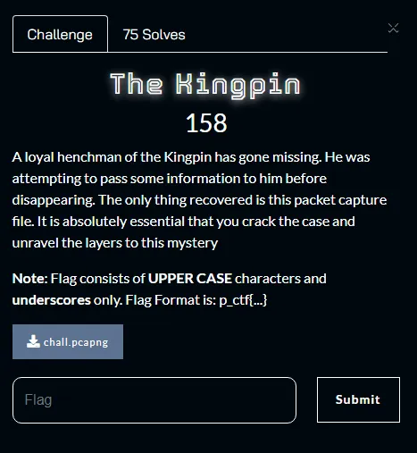
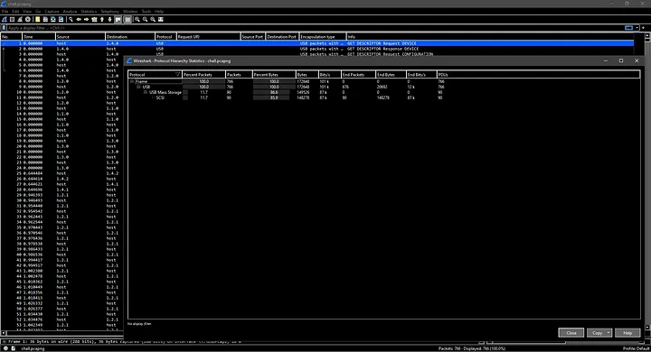
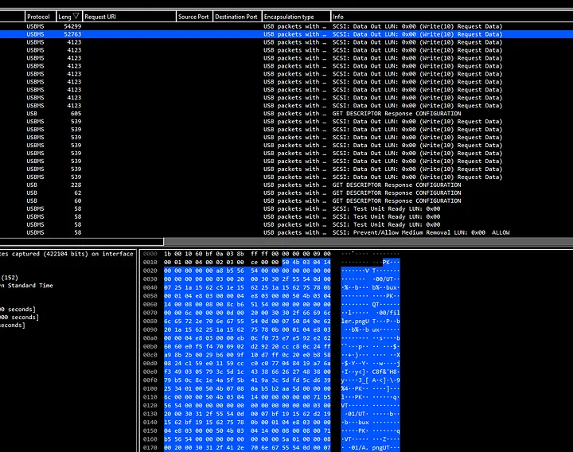
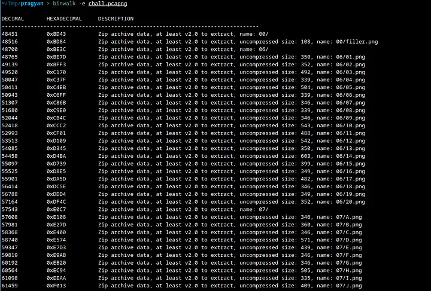
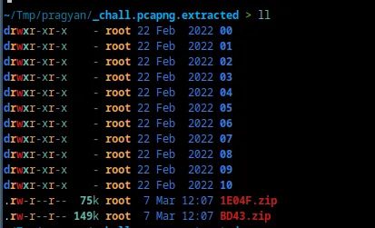
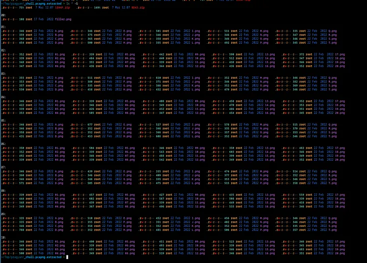
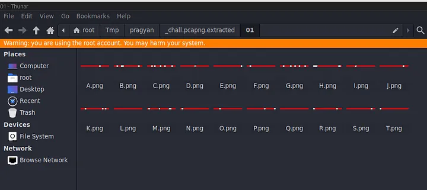
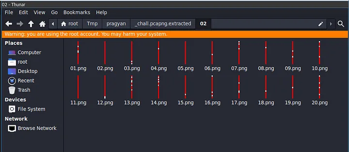
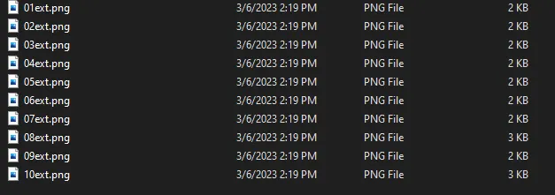
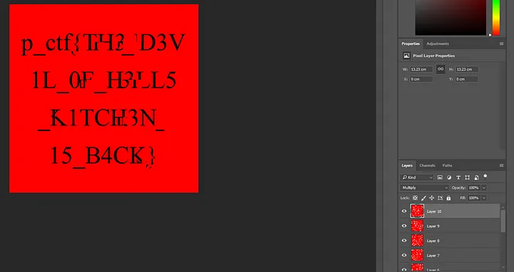

# Pragyan CTF 2023 — The Kingpin Write-up

Greetings everyone. Welcome to a very short write-up covering the Forensics challenge from Pragyan CTF 2023. Today, we will be discussing the “The Kingpin” challenge, an exciting challenge that involves some packet analysis, Image-Magick and some Photoshop (that’s how I did it at least). The challenge prompt reads —

So, we seem to have a packet capture file that we are supposed to take a look at. Let’s do exactly that.

Looks like this `PCAPNG` file contains USB-related packets. Specifically some `Mass Storage SCSI Packets`.

On sorting by the length of Packet bytes in descending order, we can see something promising. In the hex bytes, we see `PK` which suggests that this may be a `zip` file. Instead of extracting packet bytes individually for anything that was transferred, I decided to use `binwalk`.

There seem to be a couple of image files in the `zip` archives.

There are two zip files here and they contain folders of images.

As you can see each folder contains a couple of images.

So in odd-numbered folders, we have images that are horizontal lines with red and white strips.

And in even-numbered folders, we have images that are vertical lines with red and white strips. So, on googling how to merge files on Linux, I came across the `convert` command. Turns out you can vertically/horizontally stack images into a single image (-append for vertical and +append for horizontal).

On doing that, we get these final 10 images.

Now, I will be using Photoshop to try to merge these images.

What we did here is create a layer for each image on a single 500x500 blank white square. We then use the Multiply blending mode on each layer, to sort of ignore the white spaces in the overlapping of layers.

The result is not very clear, but it’s clear enough to get the flag that is `p_ctf{TH3_D3V1L_0F_H3LL5_K1TCH3N_15_B4CK}`
