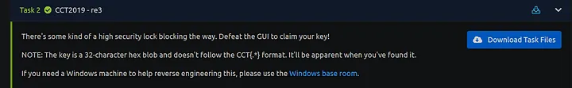
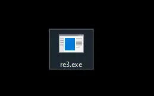
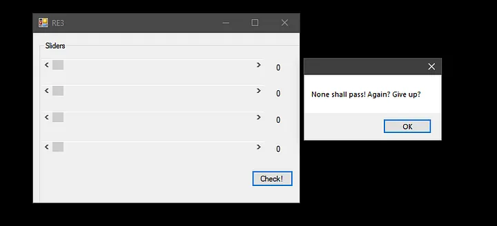
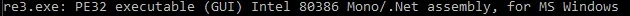
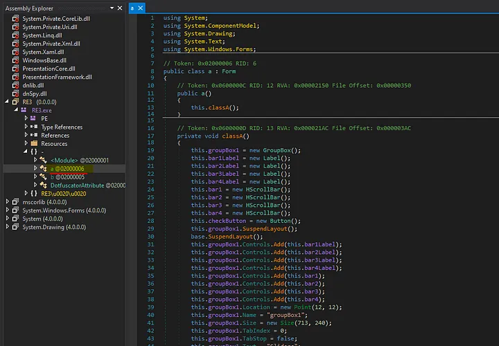
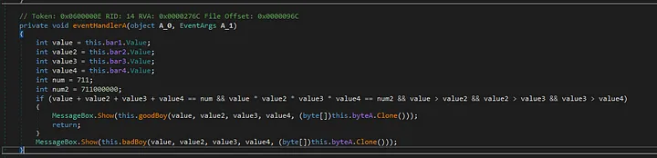
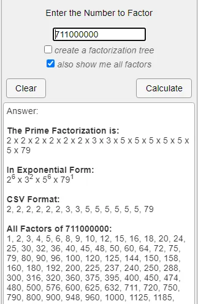
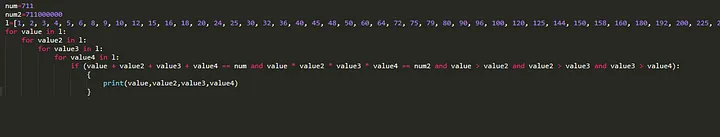
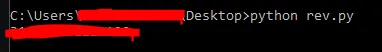
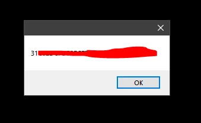

Greetings Everyone. This is a write-up on a Reversing Challenge called re3 which was made in the US Navy Cyber Competition 2019 sponsored by US TENTH Fleet. Below is the challenge prompt -

As we can see, the answer to be given here is a 32-character hex blob and not a typical flag with `CCT{*}` in it. With that said, let’s take a look at the files attached.

We get the above executable in our Task Files. Let’s try to run it.

So it seems that we get four sliders where the minimum value is 0 and the maximum value is 1024 (according to the GUI). If we enter the wrong combination of values, we get a Message Box as seen above.

Let's run `file` on this to see what kind of PE executable it is.

## Static Analysis

So, it seems that this executable is a .NET application. For that reason, I will be using one of my favourite .NET Debugger/Assembly Editors called `dnSpy`. Let’s load this up directly in the 32-bit version of it.

After opening the executable in `dnSpy`, let’s focus on the Module named `a`. This seems to contain all the relevant classes and methods within. We can ignore most of this and focus on this particular method.

So, what’s going on here? So the sliders we saw earlier are set in `this.bar1`, `this.bar2`, `this.bar3`, and `this.bar4`. These values are stored in `value`, `value2`, `value3`, `value4` respectively. An if condition is then run and an appropriate Message box is shown. If we are successful, the output of `goodBoy` would be printed. If not, `badBoy`’s output is printed (which is the error message we saw earlier).

Now taking a look at the condition, we are checking if the sum of the 4 values is 711 and their product is 711000000. Furthermore, we are also checking if the values entered respectively are in descending orderor not.

## Solution

So my first approach to this was to get the factors of 711000000. I used CalculatorSoup’s Prime Factorization Calculator and got the following result.

Now, we know that the sum cannot be more than 711. Thus, we only take the factors that are below 711 into consideration. Finally, we construct the following Python program to solve our problem.

We use the same variable names used in the decompiler’s output. Here we create a list of factors of 711000000 which are below 711. Then we run through all the possible combinations of the list in the list and see for which values the condition holds true. Therefore, we get the following output.

And thus, we set our sliders to these values in descending order and get our key.

I hope this write-up was easy to understand. Thank you for reading.
