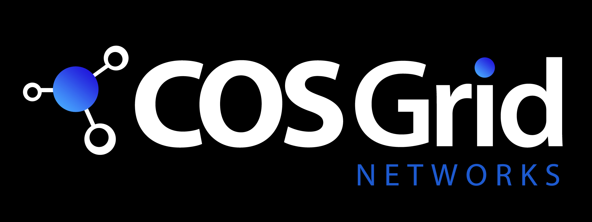

# CTFs

## Fetch the Flag CTF 2023

- Earned a rank of 39 out of 1287 teams as a member of Space.Cows.

## National Cyber League Fall 2023

- Earned a rank of 106 out of 580 participants in the Individual Game within the Experienced Students Bracket.
- Earned a rank of 63 out of 457 teams in the Team Game within the Experienced Student Division.

## CSAW 2023

- Our team “UMDCSEC” earned a rank of 1 in the qualifiers.

## HackTheBox's Cyber Apocalypse CTF 2023

- Earned a rank of 502 solving 27 challenges across categories such as Pwn, Forensics, Misc, Rev, Hardware, Crypto, and ML as the Team Captain of 0d4yR007 (2 members).

## LA CTF 2023

- Earned a rank of 186 out of 980 solving 9 challenges in the categories of Reversing, Miscellaneous, and Web.

## IrisCTF 2023

- Earned a rank of 39 as a sole competitor solving 8 challenges in the categories of Reverse Engineering, Binary Exploitation, Networks and Miscellaneous.

## DownUnderCTF 2022

- Achieved 544h place as a sole competitor (nier0x00) in the team “UMDCSEC-B”.

## Pragyan CTF 2023

- Earned a rank of 69 out of 400 participants solving one reversing and one forensics challenge.

## National Cyber League Fall 2022

- Earned a rank of 397 out of 6675 participants in the Individual Game.

## Flare-On CTF 2022

- Earned a rank of 2475 in the competition.

&#160;

# Certifications

&#160;

# Experience

## Security Engineer II - Red Team | July 2024 - Present

- Working on a cool project
- Worked on a cool exercise
- Working on cool exercises
- Did some dev work
- Shadowed two cool exercises. Will shadow some more.

&#160;

## Security Engineering Intern | May 2023 - Aug 2023

- Evaluated the effectiveness of various tools detecting security vulnerabilities within Chrome Extensions and designed a methodology to identify them at scale.
- Conducted comprehensive audits of thousands of internal Chrome Extensions using tools such as CodeQL, Tarnish, and DoubleX to identify potential security vulnerabilities.
- Created a Pull Request to enhance Tarnish's capabilities, enabling it to parse Manifest Version 3, operate on localhost, and expand its permissions identification functionality.
- Developed efficient helper scripts to optimize the process of manually auditing Chrome Extensions for vulnerabilities.
- Identified a critical exploitable bug within an internal Chrome Extension used by 20k+ Googlers and presented findings to diverse security teams.

&#160;

## ML Engineer Intern | Nov 2021 - May 2022

- Successfully implemented a data pipeline and API interface for the Taxonomy Recommendation and Classification Engine, utilizing APA's Azure SQL database.
- Developed a Ticket Priority Scheduler that utilizes a blend of classification and regression algorithms to accurately prioritize tickets with a fresh data accuracy rate of 94%.
- Conducted a comprehensive analysis of MMYT and EMT stocks, incorporating historical data from Yahoo Finance and existing quarterly financial statements to predict future stock values.
- Utilized the Sobel Edge and Harris Corner Detection techniques, in conjunction with a Gaussian mixture model, to match appliance images and group their edges and corners.

&#160;

## Cyber Security Virtual Intern | Apr 2021 - Jul 2021

- Completed three NetAcad courses (Introduction to Cyber Security, Cybersecurity Essentials and Introduction to Packet Tracer) and achieved 50% in the final assessment.
- Implemented a network simulation of Bennett University on Packet Tracer divided into several departments with DHCP, NAT, ARP, HTTP, FTP, SMTP and other protocols employed.

&#160;

## Data Security Intern | Apr 2021 - Jul 2021

- Conducted a Penetration Test on Neubrain's web server hosting WordPress websites and identified 4+ vulnerabilities including the use of unsafe WordPress plugins, weak passwords, and insecure PHP code.
- Upon immediate employment, performed Incident Response on defacement of the web server and reported the method of infiltration and exfiltration.
- Successfully hardened the WordPress server post-defacement and prevented attacks by setting up Web Application Firewalls, upgrading PHP and implementing other hardening mechanisms.
- Documented topics such as Recent Indian Data Leaks, Security Practices, Security Services, Cyber Threats to Politicians, Web Security Compliance and Mobile Security.

&#160;

## Cybersecurity Research Intern | Jan 2021 - Aug 2021

- Led a team that created an IoT Device Classification and Anomaly Detection prototype, using tools such as Spark, XGBoost, Sklearn, Zeek, Argus, and TShark, achieving 91% accuracy on fresh data. The prototype was selected as a finalist in the 'Cyber Security Grand Challenge!' organized by DSCI.
- Successfully deployed Apache Metron as a Big Data Network Intrusion Detection Solution on an AWS IoT Greengrass testbed, achieving an accuracy of 92.4% and a false positive rate of 0.24% in detecting malicious attacks automated by Guardicore's Infection Monkey.

&#160;

## Ethical Hacking Student Intern | May 2020 - Oct 2020

- Generated Penetration Testing Reports on 2 vulnerable client sites and reported several highly critical vulnerabilities such as SQL Injection and Remote Command Execution (RCE).
- Researched fileless malware, documenting Office macro attacks and in-memory injection of payloads using PowerShell and gained insight into Active Directory engagements.
- Conducted research on the internal workings of tools such as TheFatRat and Veil Framework and acquired a deeper understanding of encryption mechanisms such as XOR/AES Encryption and basic code obfuscation techniques.
- Investigated manual SQL injection, memory-based exploitation, and local/remote file inclusion attacks on dummy websites and open services on servers and developed scripts to automate exploitation using Python.
